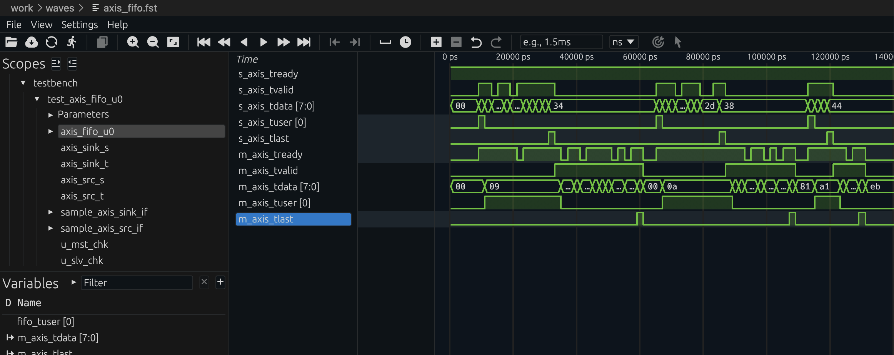
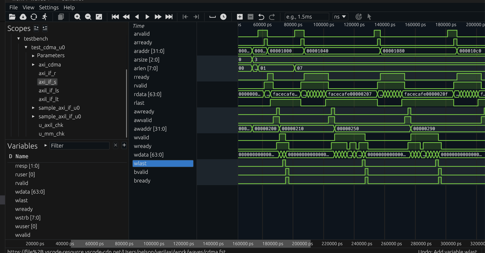
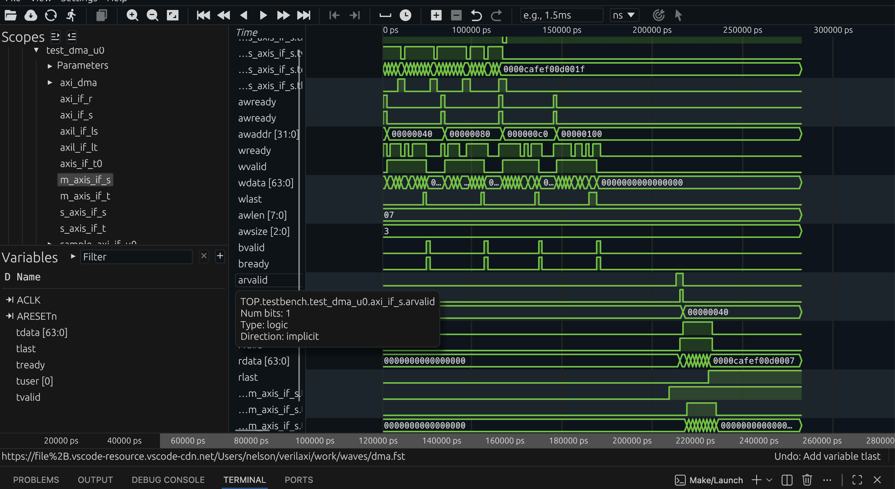

# verilaxi

**verilaxi** is a lightweight, Verilator-friendly AXI verification library written in SystemVerilog.

It provides simple, task-based **AXI**, **AXI-Lite**, and **AXI-Stream** drivers, monitors, and test environments designed for fast RTL bring-up — without UVM.

---

## ✨ Features

- ✅ AXI4, AXI-Lite, and AXI-Stream support
- ✅ Synchronous and asynchronous AXI-Stream FIFOs
- ✅ Verilator-first (tested with FST + Surfer)
- ✅ No UVM, no factory, no phases
- ✅ Task-based drivers (`write`, `read`, `write_burst`, `read_burst`)
- ✅ Parameterized widths (ADDR, DATA, ID)
- ✅ AXI stream backpressure (SRC_BP / SINK_BP) and AXI slave ready backpressure (READY_PROB)
- ✅ Selectable test scenarios via TESTTYPE plusarg
- ✅ Clean Makefile-driven test selection with interactive menu
- ✅ SVA protocol checkers for AXI4-Full, AXI-Lite, and AXI-Stream, plus 4KB AXI burst-boundary checks (Verilator `--assert`)

## Related Articles

These **sistenix** posts are the narrative layer for the repository. The intent is that a reader can understand the design choices in the blog, then inspect the exact RTL, VIP, and testbench code here in `verilaxi`.

- [Synchronous and Asynchronous FIFOs](https://sistenix.com/fifo_cdc.html) — sync FIFO flags, async FIFO Gray pointers, CDC headroom, and AXI-Stream async FIFO framing
- [AXI DMA: Moving Data Without the CPU](https://sistenix.com/axi_dma.html) — S2MM/MM2S and CDMA architecture, 4KB boundary handling, partial strobes, circular mode, and throughput
- [Writing a CSR Block Using AXI-Lite](https://sistenix.com/axi_csr.html) — self-clearing control bits, sticky status, and AXI-Lite software control patterns
- [Building SystemVerilog AXI VIP for Fast Bring-Up](https://sistenix.com/axi_vip.html) — the task-based VIP style used for fast bring-up in this repo
- [Checking AXI Protocol with SystemVerilog Assertions](https://sistenix.com/axi_sva.html) — the assertion layer used to check AXI, AXI-Lite, AXI-Stream, and 4KB burst rules
- [Building a Verilator Testbench for AXI Designs](https://sistenix.com/verilator_tb.html) — how `sim_main.cpp`, `testbench.sv`, plusargs, and `--timing` fit together
- [Reproducible RTL Simulation with Docker and GitHub Actions](https://sistenix.com/docker_ci.html) — containerized simulation, sweeps, and CI flow

---

## 📁 Repository Structure

```
verilaxi/
├── rtl/
│   ├── axi/        snix_axi_dma, snix_axi_cdma, snix_axi_mm2mm, mm2s, s2mm
│   ├── axil/       snix_axil_register, snix_axi_dma_csr, snix_axi_cdma_csr
│   ├── axis/       snix_axis_fifo, snix_axis_afifo, snix_axis_register
│   └── common/     snix_sync_fifo, snix_async_fifo, snix_register_slice
├── tb/
│   ├── classes/     axi_master, axi_slave, axil_master, axis_source, axis_sink …
│   ├── interfaces/  axi4_if, axil_if, axis_if
│   ├── packages/    axi_pkg, axi_dma_pkg, axi_cdma_pkg
│   ├── assertions/  axis_checker, axil_checker, axi_mm_checker, axi_4k_checker
│   └── tests/       test_dma, test_cdma, test_axil_register, test_axis_*
├── filelists/      common.f, tb_top.f
├── mk/             config.mk, build.mk, menu.mk, help.mk
└── Makefile
```

## 🚀 Getting Started

### Clone

```bash
git clone https://github.com/nelsoncsc/verilaxi.git
cd verilaxi
```

### Requirements

- Verilator 5.046
- SystemVerilog support enabled
- Surfer (recommended) or GTKWave for FST viewing

This repository is validated against `Verilator 5.046`. Older packaged `5.x` releases may fail to parse or build parts of the testbench and should not be assumed to work.

---
### 🧪 Example: AXI Write / Read

```systemverilog
logic [31:0] wr_data[];
logic [31:0] rd_data[];

wr_data = new[4];
rd_data = new[4];

wr_data[0] = 32'h1111_0001;
wr_data[1] = 32'h2222_0002;
wr_data[2] = 32'h3333_0003;
wr_data[3] = 32'h4444_0004;

driver.write_read_check(32'h100, wr_data, rd_data, 4);
```

### Build and Run

Interactive menu (prompts for test scenario and backpressure settings):

```bash
make
```


```bash
make run TESTNAME=dma            # AXI4 DMA (stream → memory, memory → stream)
make run TESTNAME=cdma           # AXI4 CDMA (memory-to-memory copy)
make run TESTNAME=axil_register  # AXI-Lite register
make run TESTNAME=axis_register  # AXI-Stream register slice
make run TESTNAME=axis_fifo      # AXI-Stream FIFO
make run TESTNAME=axis_afifo     # AXI-Stream async FIFO / CDC FIFO
```


```bash
# AXI-Stream async FIFO in streaming mode
make run TESTNAME=axis_afifo FRAME_FIFO=0 TESTTYPE=1 SRC_BP=1 SINK_BP=1

# AXI-Stream async FIFO in frame-store-and-forward mode
make run TESTNAME=axis_afifo FRAME_FIFO=1 TESTTYPE=1 SRC_BP=1 SINK_BP=1
```

Select a test scenario and stress with AXI slave backpressure:

```bash
# CDMA: 4KB boundary test with 80% AXI ready probability
make run TESTNAME=cdma TESTTYPE=1 READY_PROB=80
```


```bash
# DMA: 4KB boundary test
make run TESTNAME=dma TESTTYPE=3 READY_PROB=80
```


### Synthesis

```bash
make synth SYNTH_NAME=axis_fifo      SYNTH_TARGET=generic
make synth SYNTH_NAME=axis_afifo     SYNTH_TARGET=artix7
make synth SYNTH_NAME=dma            SYNTH_TARGET=artix7
make synth SYNTH_NAME=cdma           SYNTH_TARGET=generic
```

Simulation logs and FST waveforms are written with parameter-aware filenames so sweep runs do not overwrite each other. For example, `make run TESTNAME=axis_afifo FRAME_FIFO=1 TESTTYPE=1 SRC_BP=1 SINK_BP=1` produces `work/logs/axis_afifo_ff1_tt1_src1_sink1.log` and `work/waves/axis_afifo_ff1_tt1_src1_sink1.fst`.

## Docker

A minimal Docker environment is included for reproducible Linux runs with `Verilator 5.046`, `Yosys`, and `make`.

```bash
docker build -t verilaxi .
docker run --rm -it -v "$PWD":/workspace -w /workspace verilaxi \
  make run OBJ_DIR=work/obj_dir_linux TESTNAME=axis_afifo FRAME_FIFO=1 TESTTYPE=1 SRC_BP=1 SINK_BP=1
```

This is also the recommended cross-platform path for macOS, Linux, and Windows via WSL2 when you want a consistent tool environment. Using a container-specific `OBJ_DIR` avoids collisions between host-built binaries and Linux container builds.

Useful Docker examples:

```bash
# Tool versions
docker run --rm -it -v "$PWD":/workspace -w /workspace verilaxi \
  bash -lc "verilator --version && yosys -V"

# Synthesis
docker run --rm -it -v "$PWD":/workspace -w /workspace verilaxi \
  make synth SYNTH_NAME=axis_afifo SYNTH_TARGET=generic

# Sweep wrapper
docker run --rm -it -v "$PWD":/workspace -w /workspace verilaxi \
  ./scripts/sweep.sh synth generic
```

## Sweep Script

A convenience regression script is included for broader simulation and synthesis sweeps:

```bash
scripts/sweep.sh sim
scripts/sweep.sh synth both
scripts/sweep.sh all both
```

The simulation sweep covers the AXIS register/FIFO/AFIFO matrices, `axil_register`, and DMA/CDMA runs with `READY_PROB=70`. The synthesis sweep covers all supported synth targets for `generic`, `artix7`, or both.

## Acknowledgements

This project was developed independently. Credit is due to the wider open-source AXI community for helping shape good engineering practice around AXI design and verification. In particular, ZipCPU's AXI articles and examples, together with Alex Forencich's AXI and AXI-Stream component work, were useful sources of inspiration and reference.

This repository does not use code from my current or previous employers; rather, it is a summary of my learnings during my spare time. AI tools were used as auxiliary tools for debugging, scripting, and documentation support.
