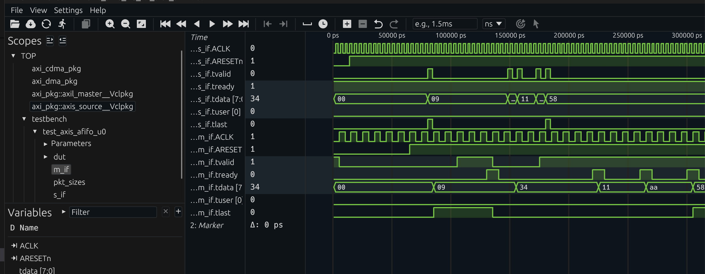
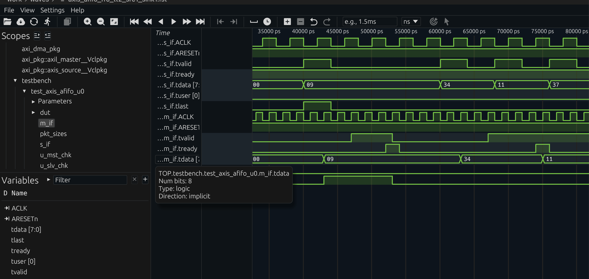

# Verilaxi — Developer Guide

**Project:** `verilaxi`
**Toolchain:** Verilator (SystemVerilog simulation)
**Interfaces:** AXI4-Full · AXI4-Lite · AXI4-Stream
**Engines:** S2MM · MM2S · MM2MM (CDMA)

---

## Table of Contents

1. [Project Overview](#1-project-overview)
2. [Repository Structure](#2-repository-structure)
3. [Module Descriptions](#3-module-descriptions)
   - 3.1 [snix_axi_dma — Top-Level DMA](#31-snix_axi_dma--top-level-dma)
   - 3.2 [snix_axi_s2mm — Stream-to-Memory Engine](#32-snix_axi_s2mm--stream-to-memory-engine)
   - 3.3 [snix_axi_mm2s — Memory-to-Stream Engine](#33-snix_axi_mm2s--memory-to-stream-engine)
   - 3.4 [snix_axi_dma_csr — DMA Control & Status Registers](#34-snix_axi_dma_csr--dma-control--status-registers)
   - 3.5 [snix_axis_fifo — AXI-Stream FIFO](#35-snix_axis_fifo--axi-stream-fifo)
   - 3.6 [snix_axis_arbiter — AXI-Stream Arbiter](#36-snix_axis_arbiter--axi-stream-arbiter)
   - 3.7 [snix_axis_afifo — AXI-Stream Async FIFO](#37-snix_axis_afifo--axi-stream-async-fifo)
   - 3.8 [snix_axi_mm2mm — Memory-to-Memory Engine](#38-snix_axi_mm2mm--memory-to-memory-engine)
   - 3.9 [snix_axi_cdma — Top-Level Central DMA](#39-snix_axi_cdma--top-level-central-dma)
   - 3.10 [snix_axi_cdma_csr — CDMA Control & Status Registers](#310-snix_axi_cdma_csr--cdma-control--status-registers)
4. [CSR Register Maps](#4-csr-register-maps)
   - 4.1 [DMA Register Map (snix_axi_dma_csr)](#41-dma-register-map-snix_axi_dma_csr)
   - 4.2 [CDMA Register Map (snix_axi_cdma_csr)](#42-cdma-register-map-snix_axi_cdma_csr)
5. [AXI Interface Signals](#5-axi-interface-signals)
   - 5.1 [AXI-Lite Slave (Control)](#51-axi-lite-slave-control)
   - 5.2 [AXI4-Full Master — S2MM Write Channels](#52-axi4-full-master--s2mm-write-channels)
   - 5.3 [AXI4-Full Master — MM2S Read Channels](#53-axi4-full-master--mm2s-read-channels)
   - 5.4 [AXI4-Stream Slave (S2MM Input)](#54-axi4-stream-slave-s2mm-input)
   - 5.5 [AXI4-Stream Master (MM2S Output)](#55-axi4-stream-master-mm2s-output)
   - 5.6 [AXI4-Full Master — CDMA MM2MM Port](#56-axi4-full-master--cdma-mm2mm-port)
6. [Verification IP (VIP) Reference](#6-verification-ip-vip-reference)
   - 6.1 [Package Overview](#61-package-overview)
   - 6.2 [axil_master](#62-axil_master)
   - 6.3 [axis_source](#63-axis_source)
   - 6.4 [axis_sink](#64-axis_sink)
   - 6.5 [axi_slave](#65-axi_slave)
   - 6.6 [axi_dma_driver](#66-axi_dma_driver)
   - 6.7 [axi_cdma_driver](#67-axi_cdma_driver)
7. [Simulation Guide](#7-simulation-guide)
   - 7.1 [Prerequisites](#71-prerequisites)
   - 7.2 [Running Tests](#72-running-tests)
   - 7.3 [Viewing Waveforms](#73-viewing-waveforms)
   - 7.4 [Writing a New Test](#74-writing-a-new-test)
   - 7.5 [SVA Protocol Checkers](#75-sva-protocol-checkers)
8. [FSM State Diagrams](#8-fsm-state-diagrams)
9. [Design Notes](#9-design-notes)

---

## 1. Project Overview

**Verilaxi** is a synthesisable AXI DMA subsystem with a self-contained Verilator-based verification environment. It also includes reusable AXI-Stream infrastructure blocks such as `snix_axis_register`, `snix_axis_arbiter`, `snix_axis_fifo`, and `snix_axis_afifo` for stream pipelining, arbitration, buffering, and clock-domain crossing.

It contains two top-level DMA IP blocks:

**`snix_axi_dma` — Streaming DMA** moves data between an AXI4-Stream interface and AXI4-Full memory using two independent engines:

- **S2MM** (Stream-to-Memory-Mapped) — receives an AXI-Stream and writes it to memory via AXI4 write channels.
- **MM2S** (Memory-Mapped-to-Stream) — reads from memory via AXI4 read channels and produces an AXI-Stream.

Both engines are configured through an AXI-Lite register interface and share a common register block (`snix_axi_dma_csr`). Each engine has an internal AXI-Stream FIFO that decouples the stream-side datapath from the memory-side burst engine.


**`snix_axi_cdma` — Central DMA** performs memory-to-memory copies over a single AXI4-Full port with no stream interfaces:

- **MM2MM** (Memory-Mapped-to-Memory-Mapped) — reads a contiguous block from a source address and writes it to a destination address, handling 4KB boundary splitting and partial last-beat strobes automatically.


## 2. Repository Structure

```
verilaxi/
├── Makefile                  Top-level build entry point
├── mk/
│   ├── config.mk             Test names, paths, Verilator flags
│   ├── build.mk              Verilator compile & run targets
│   ├── menu.mk               Interactive test menu
│   └── help.mk               Help text
├── filelists/
│   ├── common.f              RTL + shared TB file list
│   └── tb_top.f              Testbench top file list
├── rtl/
│   ├── axi/
│   │   ├── snix_axi_dma.sv   Top-level streaming DMA (S2MM + MM2S + CSR)
│   │   ├── snix_axi_s2mm.sv  Stream-to-Memory engine
│   │   ├── snix_axi_mm2s.sv  Memory-to-Stream engine
│   │   ├── snix_axi_cdma.sv  Top-level Central DMA (MM2MM + CSR)
│   │   └── snix_axi_mm2mm.sv Memory-to-Memory engine
│   ├── axil/
│   │   ├── snix_axi_dma_csr.sv   AXI-Lite register file (DMA)
│   │   ├── snix_axi_cdma_csr.sv  AXI-Lite register file (CDMA)
│   │   └── snix_axil_register.sv
│   ├── axis/
│   │   ├── snix_axis_arbiter.sv AXI-Stream packet/beat/weighted arbiter
│   │   ├── snix_axis_fifo.sv    AXI-Stream FIFO wrapper
│   │   ├── snix_axis_afifo.sv   AXI-Stream async FIFO / CDC wrapper
│   │   └── snix_axis_register.sv
│   └── common/
│       ├── snix_sync_fifo.sv    Synchronous FIFO primitive
│       ├── snix_async_fifo.sv   Asynchronous FIFO primitive
│       └── snix_register_slice.sv
├── tb/
│   ├── packages/
│   │   ├── axi_pkg.sv        Packages all VIP classes
│   │   ├── axi_dma_pkg.sv    DMA driver class + CSR constants
│   │   └── axi_cdma_pkg.sv   CDMA driver class + CSR constants
│   ├── interfaces/
│   │   ├── axi_if.sv         AXI4-Full interface
│   │   ├── axil_if.sv        AXI4-Lite interface
│   │   └── axis_if.sv        AXI4-Stream interface
│   ├── classes/
│   │   ├── axi/              axi_master, axi_slave, axi_driver
│   │   ├── axil/             axil_master, axil_slave, axil_driver
│   │   └── axis/             axis_source, axis_sink, axis_connect, axis_driver
│   ├── assertions/
│   │   ├── axis_checker.sv   AXI-Stream SVA checker (4 rules)
│   │   ├── axil_checker.sv   AXI-Lite SVA checker (5 rules)
│   │   ├── axi_mm_checker.sv AXI4-Full SVA checker (7 rules)
│   │   └── axi_4k_checker.sv AXI4 4KB burst-boundary checker
│   ├── tests/
│   │   ├── axi/              test_dma.sv (DMA integration), test_cdma.sv (CDMA integration)
│   │   ├── axil/             test_axil_register.sv
│   │   └── axis/             test_axis_fifo.sv, test_axis_afifo.sv, test_axis_register.sv
│   └── top/
│       └── testbench.sv      Top-level testbench (compile-time test select)
├── tb_cpp/
│   └── sim_main.cpp          Verilator C++ entry point
└── work/
    ├── logs/                 Simulation logs per test
    └── waves/                FST waveform files per test
```

---

## 3. Module Descriptions

### 3.1 `snix_axi_dma` — Top-Level DMA

**File:** `rtl/axi/snix_axi_dma.sv`

**Background article:** [AXI DMA: Moving Data Without the CPU](https://sistenix.com/axi_dma.html)

The integration wrapper that instantiates and wires together the CSR, S2MM engine, and MM2S engine.

**Parameters**

| Parameter        | Default | Description                          |
|------------------|---------|--------------------------------------|
| `ADDR_WIDTH`     | 32      | AXI4-Full address width (bits)       |
| `DATA_WIDTH`     | 64      | AXI4-Full / Stream data width (bits) |
| `AXIL_ADDR_WIDTH`| 32      | AXI-Lite address width (bits)        |
| `AXIL_DATA_WIDTH`| 32      | AXI-Lite data width (bits)           |
| `ID_WIDTH`       | 4       | AXI ID width (bits)                  |
| `USER_WIDTH`     | 1       | AXI USER sideband width (bits)       |

**Internal constants**

| Constant          | Value | Description                             |
|-------------------|-------|-----------------------------------------|
| `NUM_REGS`        | 16    | Total register slots in CSR bank        |
| `FIFO_DEPTH_S2MM` | 16    | FIFO depth for the S2MM engine          |
| `FIFO_DEPTH_MM2S` | 16    | FIFO depth for the MM2S engine          |

**Connectivity summary**
The top level decodes the CSR output bus (`config_status_reg`) to individual control signals and drives them into the two engines. The engines' `ctrl_wr_done` / `ctrl_rd_done` pulses are fed back into the CSR's `read_status_reg` input so the STATUS register is updated in hardware.

---

### 3.2 `snix_axi_s2mm` — Stream-to-Memory Engine

**File:** `rtl/axi/snix_axi_s2mm.sv`

Receives data from an AXI4-Stream slave port and writes it to memory using AXI4-Full write channels (AW · W · B). Features include:

- **4K boundary compliance** — burst length is automatically clipped at 4 KB page boundaries.
- **Two-stage burst pipeline** (PREP1 → PREP2) to keep critical-path combinational depth minimal.
- **Circular mode** — on completion the engine immediately reloads the base address and transfer length from the control inputs and restarts, enabling continuous ring-buffer operation.
- **Abort** — asserting `ctrl_wr_stop` causes the FSM to return to IDLE at the next safe point.
- **Partial write strobe** — the last beat of a transfer uses a byte-accurate `wstrb` mask so only valid bytes are committed to memory.
- **Single-cycle done pulse** — `ctrl_wr_done` fires for exactly one clock cycle when the FSM transitions into IDLE (whether on completion or abort).

**Parameters** — same set as the top-level (`ADDR_WIDTH`, `DATA_WIDTH`, `ID_WIDTH`, `USER_WIDTH`, `FIFO_DEPTH`).

**FSM states**

| State       | Description                                              |
|-------------|----------------------------------------------------------|
| `IDLE`      | Waiting for `ctrl_wr_start` assertion                   |
| `PREP1`     | Stage 1 of burst calculation: 4K boundary check         |
| `PREP2`     | Stage 2: final `awlen` and `burst_actual_bytes` latched  |
| `AW`        | AW channel handshake; address/byte counters updated      |
| `WRITE`     | W channel beats transferred from internal FIFO           |
| `WAIT_BRESP`| Waiting for B-channel response; decides loop or stop     |

**Static AXI attributes** — the engine always issues INCR bursts (`awburst = 2'b01`), with `awid`, `awlock`, `awcache`, `awprot`, `awqos`, and `awuser` all tied to zero.

---

### 3.3 `snix_axi_mm2s` — Memory-to-Stream Engine

**File:** `rtl/axi/snix_axi_mm2s.sv`

Reads data from memory using AXI4-Full read channels (AR · R) and forwards it to an AXI4-Stream master port. Features mirror the S2MM engine:

- **4K boundary compliance** with identical two-stage PREP pipeline.
- **Transfer length alignment** — the requested byte count is rounded up to the next beat boundary (determined by `ctrl_rd_size`) because AXI reads always return full beats.
- **Circular mode** with seamless restart on completion.
- **Abort** on `ctrl_rd_stop` assertion.
- **R-channel gating** — `mm2s_rready` is only asserted when the FSM is in the `READ` state, preventing spurious data capture if the interconnect responds in the same cycle as `arready`.
- **Single-cycle done pulse** on FSM → IDLE transition.

**Parameters** — identical to S2MM.

**FSM states**

| State       | Description                                              |
|-------------|----------------------------------------------------------|
| `IDLE`      | Waiting for `ctrl_rd_start` assertion                   |
| `PREP1`     | Stage 1: 4K boundary check                              |
| `PREP2`     | Stage 2: final `arlen` and `burst_actual_bytes` latched  |
| `AR`        | AR channel handshake; address/byte counters updated      |
| `READ`      | R-channel data accepted into internal FIFO               |
| `WAIT_RRESP`| All beats received; decides loop or stop                 |

**Static AXI attributes** — INCR bursts (`arburst = 2'b01`); `arid`, `arlock`, `arcache`, `arprot`, `arqos`, and `aruser` tied to zero.

---

### 3.4 `snix_axi_dma_csr` — DMA Control & Status Registers

**File:** `rtl/axil/snix_axi_dma_csr.sv`

**Background article:** [Writing a CSR Block Using AXI-Lite](https://sistenix.com/axi_csr.html)

An AXI-Lite slave register file that provides the software-visible control and status interface for the DMA.

**Parameters**

| Parameter   | Default | Description                     |
|-------------|---------|---------------------------------|
| `DATA_WIDTH`| 32      | Register (and AXI-Lite) width   |
| `ADDR_WIDTH`| 4       | AXI-Lite address bus width      |
| `NUM_REGS`  | 16      | Number of 32-bit register slots |

**Key behaviours**

- Write and read address channels are each buffered by a `snix_register_slice` to improve timing closure.
- `ctrl_wr_start`, `ctrl_wr_stop`, `ctrl_rd_start`, `ctrl_rd_stop` are **self-clearing** — the CSR clears bits `[0]` and `[1]` of `WR_CTRL` / `RD_CTRL` one cycle after they are written, so software writes a pulse rather than a level.
- STATUS bits `[0]` (`wr_done`) and `[1]` (`rd_done`) are **sticky** — they latch the one-cycle done pulses from the engines and remain set until software writes `0` to clear them.
- All responses are `OKAY` (`bresp` / `rresp` = `2'b00`).

---

### 3.5 `snix_axis_fifo` — AXI-Stream FIFO

**File:** `rtl/axis/snix_axis_fifo.sv`

**Background article:** [Synchronous and Asynchronous FIFOs](https://sistenix.com/fifo_cdc.html)

An AXI4-Stream-compliant synchronous FIFO, used internally by both the S2MM and MM2S engines to decouple the stream and memory-bus datapaths.

**Parameters**

| Parameter   | Default | Description                        |
|-------------|---------|------------------------------------|
| `DATA_WIDTH`| 32      | Bit width of `tdata`               |
| `USER_WIDTH`| 1       | Bit width of `tuser`               |
| `FIFO_DEPTH`| 16      | Number of entries (must be power of 2) |

**Behaviour** — `s_axis_tready` is de-asserted whenever the internal `snix_sync_fifo` is full; `m_axis_tvalid` is asserted whenever data is available. The module packs `{tdata, tuser, tlast}` into a single wide word for the underlying FIFO primitive.

---

### 3.6 `snix_axis_arbiter` — AXI-Stream Arbiter

**File:** `rtl/axis/snix_axis_arbiter.sv`

**Background article:** [AXI-Stream Arbitration in SystemVerilog](https://sistenix.com/axi_arbiter.html)


An AXI4-Stream arbiter that supports three closely related policies in the same RTL:

- **packet round-robin** — hold the current grant until `TLAST`
- **beat round-robin** — rotate after every accepted beat
- **weighted packet round-robin** — round-robin order constrained by per-source credits

**Parameters**

| Parameter    | Default | Description                                                    |
|--------------|---------|----------------------------------------------------------------|
| `NUM_SRCS`   | 4       | Number of AXI-Stream sources                                   |
| `DATA_WIDTH` | 8       | Bit width of `tdata`                                           |
| `USER_WIDTH` | 1       | Bit width of `tuser`                                           |
| `HOLD_PACKET`| 1       | `1` = packet mode, `0` = beat mode                             |
| `WEIGHT_W`   | 4       | Bit width of each packed weight field                          |
| `WEIGHTS`    | `'0`    | Packed `{W[N-1], ..., W1, W0}` service weights                 |

**Key behaviours**

- The combinational scan starts at `rr_ptr` and wraps around with modular arithmetic, so the previous winner is not immediately reconsidered first.
- `locked` has a dual role: it holds a selected source stable while a beat is stalled, and in packet mode it extends that hold across all beats of a multi-beat packet.
- `HOLD_PACKET=1'b1` keeps the grant until `TVALID && TREADY && TLAST`; `HOLD_PACKET=1'b0` makes the same state machine rotate on every accepted beat.
- `WEIGHTS` are packed with source 0 in the least-significant slice. A configured weight of zero is treated as one by the `cfg_weight()` helper, so the default `'0` naturally becomes equal round-robin.
- Only the effective selected source sees `s_axis_tready=1`; all others are backpressured.

**Verification hooks**

- `test_axis_arbiter.sv` checks packet-mode arbitration in both sequential and concurrent traffic phases and closes with `72` beats and `16` packets.
- `test_axis_arbiter_beat.sv` checks strict `0,1,2,3,...` accepted-beat rotation when backpressure is disabled.
- `test_axis_arbiter_weighted.sv` checks exact grant ratios for a packed weight configuration such as `{W3, W2, W1, W0} = {1,1,2,4}`.

---

### 3.7 `snix_axis_afifo` — AXI-Stream Async FIFO

**File:** `rtl/axis/snix_axis_afifo.sv`

**Background article:** [Synchronous and Asynchronous FIFOs](https://sistenix.com/fifo_cdc.html)

An AXI4-Stream asynchronous FIFO for clock-domain crossing between independent source and sink clocks. Like `snix_axis_fifo`, it transports `tdata`, `tuser`, and `tlast`, but it uses `snix_async_fifo` internally and exposes separate `s_axis_clk` and `m_axis_clk` domains.


**Parameters**

| Parameter    | Default | Description                                                      |
|--------------|---------|------------------------------------------------------------------|
| `DATA_WIDTH` | 32      | Bit width of `tdata`                                             |
| `USER_WIDTH` | 1       | Bit width of `tuser`                                             |
| `FIFO_DEPTH` | 16      | Number of entries (must be power of 2)                           |
| `FRAME_FIFO` | 0       | `0` = streaming/cut-through, `1` = frame-aware store-and-forward |

**Behaviour**

- In **streaming mode** (`FRAME_FIFO=0`), the output side may begin draining as soon as entries are available in the async FIFO.
- In **frame mode** (`FRAME_FIFO=1`), the read side waits until a complete packet has been written before asserting output valid, so frames are emitted atomically.
- Frame completion crosses from the write clock domain to the read clock domain using a toggle-based event synchroniser, which avoids missing a one-cycle packet-done pulse when the two clocks are asynchronous.

---

### 3.8 `snix_axi_mm2mm` — Memory-to-Memory Engine

**File:** `rtl/axi/snix_axi_mm2mm.sv`

Reads a contiguous block from a source address and writes it to a destination address over a single shared AXI4-Full port. There are no stream interfaces; all data movement is internal via an `snix_axis_fifo` that bridges the read and write paths.

- **4K boundary compliance** — both the read (AR) and write (AW) address pointers are split at 4 KB boundaries using the same two-stage PREP pipeline as S2MM/MM2S.
- **Single AXI port** — read and write channels share one AXI4 connection. The FSM serialises them: read burst completes fully before the write burst begins.
- **Partial write strobe** — the last beat of the final write burst uses a byte-accurate `wstrb` mask.
- **Abort** — asserting `ctrl_stop` causes the FSM to return to IDLE after the current B-channel response.
- **Single-cycle done pulse** — `ctrl_done` fires for one clock cycle on FSM → IDLE.

**Parameters** — `ADDR_WIDTH`, `DATA_WIDTH`, `ID_WIDTH`, `USER_WIDTH`, `FIFO_DEPTH`.

**FSM states**

| State        | Description                                                         |
|--------------|---------------------------------------------------------------------|
| `IDLE`       | Waiting for `ctrl_start` rising edge                               |
| `PREP1`      | Stage 1: 4K boundary check (src address used for the check)        |
| `PREP2`      | Stage 2: `arlen`/`awlen` and `burst_actual_bytes` latched          |
| `AR`         | AR handshake; `src_axi_addr` and `pending_bytes` updated           |
| `READ`       | R-channel beats accepted into internal FIFO                        |
| `AW`         | AW handshake; `dst_axi_addr` and `copied_bytes` updated            |
| `WRITE`      | W-channel beats drained from internal FIFO                         |
| `WAIT_BRESP` | Waiting for B response; decides next burst or IDLE                 |

---

### 3.9 `snix_axi_cdma` — Top-Level Central DMA

**File:** `rtl/axi/snix_axi_cdma.sv`

**Background article:** [AXI DMA: Moving Data Without the CPU](https://sistenix.com/axi_dma.html)

Integration wrapper that instantiates `snix_axi_cdma_csr` and `snix_axi_mm2mm`.

**Parameters**

| Parameter         | Default | Description                          |
|-------------------|---------|--------------------------------------|
| `ADDR_WIDTH`      | 32      | AXI4-Full address width (bits)       |
| `DATA_WIDTH`      | 64      | AXI4-Full data width (bits)          |
| `AXIL_ADDR_WIDTH` | 32      | AXI-Lite address width (bits)        |
| `AXIL_DATA_WIDTH` | 32      | AXI-Lite data width (bits)           |
| `ID_WIDTH`        | 4       | AXI ID width (bits)                  |
| `USER_WIDTH`      | 1       | AXI USER sideband width (bits)       |

**Internal constants** — `FIFO_DEPTH = 16`, `NUM_REGS = 8`.

**Connectivity** — The top level decodes `config_status_reg` from the CSR into individual control signals (`ctrl_start`, `ctrl_stop`, `ctrl_size`, `ctrl_len`, `ctrl_transfer_len`, `ctrl_src_addr`, `ctrl_dst_addr`) and drives them into the MM2MM engine. The engine's `ctrl_done` pulse is fed back into `read_status_reg[0]` so STATUS is updated by hardware.

---

### 3.10 `snix_axi_cdma_csr` — CDMA Control & Status Registers

**File:** `rtl/axil/snix_axi_cdma_csr.sv`

AXI-Lite slave register file for the CDMA. Structure mirrors `snix_axi_dma_csr` but with a single-channel control path and two address registers.

**Key behaviours**

- `ctrl_start` (bit `[0]` of CDMA_CTRL) and `ctrl_stop` (bit `[1]`) are **self-clearing** — cleared one cycle after being written.
- STATUS register (`offset 0x10`) is **write-protected** — the CSR ignores AXI-Lite writes to that address. The done bit is set only by the `ctrl_done` pulse from the MM2MM engine.
- The done bit is **cleared automatically** when `ctrl_start` fires, so software does not need to manually clear STATUS before restarting.

---

## 4. CSR Register Maps

Base address is application-defined. All registers are 32 bits wide. Byte offsets assume `AXIL_DATA_WIDTH = 32`.

### 4.1 DMA Register Map (`snix_axi_dma_csr`)

| Offset | Name          | Access | Description                        |
|--------|---------------|--------|------------------------------------|
| `0x00` | `WR_CTRL`     | R/W    | S2MM control — start/stop/circular/size/len |
| `0x04` | `WR_NUM_BYTES`| R/W    | S2MM total transfer length in bytes |
| `0x08` | `WR_ADDR`     | R/W    | S2MM AXI write base address        |
| `0x0C` | `RD_CTRL`     | R/W    | MM2S control — start/stop/circular/size/len |
| `0x10` | `RD_NUM_BYTES`| R/W    | MM2S total transfer length in bytes |
| `0x14` | `RD_ADDR`     | R/W    | MM2S AXI read base address         |
| `0x18` | `STATUS`      | R/W    | Done flags (sticky, write 0 to clear) |

### 0x00 — WR_CTRL

| Bits    | Field               | Access | Description                                         |
|---------|---------------------|--------|-----------------------------------------------------|
| `[0]`   | `ctrl_wr_start`     | W1S    | Write `1` to start S2MM. Self-clears next cycle.   |
| `[1]`   | `ctrl_wr_stop`      | W1S    | Write `1` to abort S2MM. Self-clears next cycle.   |
| `[2]`   | `ctrl_wr_circular`  | R/W    | `1` = circular (ring-buffer) mode                  |
| `[5:3]` | `ctrl_wr_size`      | R/W    | AXI burst size: `0`=1B, `1`=2B, `2`=4B, `3`=8B … (AXI `awsize` encoding) |
| `[13:6]`| `ctrl_wr_len`       | R/W    | Maximum AXI burst length − 1 (`awlen` value)       |
| `[31:14]`| —                  | —      | Reserved, write zero                                |

### 0x04 — WR_NUM_BYTES

| Bits    | Field                  | Access | Description                        |
|---------|------------------------|--------|------------------------------------|
| `[31:0]`| `ctrl_wr_transfer_len` | R/W    | Total bytes to transfer (S2MM)     |

### 0x08 — WR_ADDR

| Bits    | Field          | Access | Description                              |
|---------|----------------|--------|------------------------------------------|
| `[31:0]`| `ctrl_wr_addr` | R/W    | AXI write base address for S2MM          |

### 0x0C — RD_CTRL

| Bits    | Field               | Access | Description                                         |
|---------|---------------------|--------|-----------------------------------------------------|
| `[0]`   | `ctrl_rd_start`     | W1S    | Write `1` to start MM2S. Self-clears next cycle.   |
| `[1]`   | `ctrl_rd_stop`      | W1S    | Write `1` to abort MM2S. Self-clears next cycle.   |
| `[2]`   | `ctrl_rd_circular`  | R/W    | `1` = circular (ring-buffer) mode                  |
| `[5:3]` | `ctrl_rd_size`      | R/W    | AXI burst size (AXI `arsize` encoding)              |
| `[13:6]`| `ctrl_rd_len`       | R/W    | Maximum AXI burst length − 1 (`arlen` value)       |
| `[31:14]`| —                  | —      | Reserved, write zero                                |

### 0x10 — RD_NUM_BYTES

| Bits    | Field                  | Access | Description                        |
|---------|------------------------|--------|------------------------------------|
| `[31:0]`| `ctrl_rd_transfer_len` | R/W    | Total bytes to transfer (MM2S). Internally rounded up to the next beat boundary. |

### 0x14 — RD_ADDR

| Bits    | Field          | Access | Description                              |
|---------|----------------|--------|------------------------------------------|
| `[31:0]`| `ctrl_rd_addr` | R/W    | AXI read base address for MM2S           |

### 0x18 — STATUS

| Bits    | Field          | Access | Description                                            |
|---------|----------------|--------|--------------------------------------------------------|
| `[0]`   | `wr_done`      | R/W1C  | Set when S2MM transfer completes or is aborted. Write `0` to clear. |
| `[1]`   | `rd_done`      | R/W1C  | Set when MM2S transfer completes or is aborted. Write `0` to clear. |
| `[31:2]`| —              | —      | Reserved                                               |

### Typical Initialisation Sequence (S2MM)

```
// 1. Set write destination address
write_reg(WR_ADDR,      0x8000_0000);

// 2. Set transfer length in bytes
write_reg(WR_NUM_BYTES, 1024);

// 3. Configure burst parameters and start
//    size=3 (8 B/beat), len=7 (8-beat bursts), start=1
write_reg(WR_CTRL, (7 << 6) | (3 << 3) | 0x1);

// 4. Poll for completion
while (!(read_reg(STATUS) & 0x1));

// 5. Clear done bit
write_reg(STATUS, 0x0);
```

---

### 4.2 CDMA Register Map (`snix_axi_cdma_csr`)

| Offset  | Name            | Access | Description                              |
|---------|-----------------|--------|------------------------------------------|
| `0x00`  | `CDMA_CTRL`     | R/W    | Control — start/stop/size/len            |
| `0x04`  | `CDMA_NUM_BYTES`| R/W    | Total transfer length in bytes           |
| `0x08`  | `CDMA_SRC_ADDR` | R/W    | Source base address                      |
| `0x0C`  | `CDMA_DST_ADDR` | R/W    | Destination base address                 |
| `0x10`  | `STATUS`        | R only | Done flag (sticky, write-protected)      |

### 0x00 — CDMA_CTRL

| Bits     | Field        | Access | Description                                              |
|----------|--------------|--------|----------------------------------------------------------|
| `[0]`    | `ctrl_start` | W1S    | Write `1` to start. Self-clears next cycle.              |
| `[1]`    | `ctrl_stop`  | W1S    | Write `1` to abort. Self-clears next cycle.              |
| `[5:3]`  | `ctrl_size`  | R/W    | AXI burst size (`arsize`/`awsize` encoding)              |
| `[13:6]` | `ctrl_len`   | R/W    | Maximum AXI burst length − 1 (`arlen`/`awlen` value)     |
| `[31:14]`| —            | —      | Reserved, write zero                                     |

### 0x04 — CDMA_NUM_BYTES

| Bits     | Field                | Access | Description                        |
|----------|----------------------|--------|------------------------------------|
| `[31:0]` | `ctrl_transfer_len`  | R/W    | Total bytes to copy                |

### 0x08 — CDMA_SRC_ADDR

| Bits     | Field          | Access | Description                   |
|----------|----------------|--------|-------------------------------|
| `[31:0]` | `ctrl_src_addr`| R/W    | Source base address (AR path) |

### 0x0C — CDMA_DST_ADDR

| Bits     | Field          | Access | Description                        |
|----------|----------------|--------|------------------------------------|
| `[31:0]` | `ctrl_dst_addr`| R/W    | Destination base address (AW path) |

### 0x10 — STATUS

| Bits     | Field      | Access | Description                                                |
|----------|------------|--------|------------------------------------------------------------|
| `[0]`    | `done`     | R      | Set when copy completes or is aborted. Cleared by next `ctrl_start`. Write-protected. |
| `[31:1]` | —          | —      | Reserved                                                   |

### Typical Initialisation Sequence (CDMA)

```
// 1. Set source and destination addresses
write_reg(CDMA_SRC_ADDR,  0x0000_1000);
write_reg(CDMA_DST_ADDR,  0x0000_2000);

// 2. Set transfer length in bytes
write_reg(CDMA_NUM_BYTES, 256);

// 3. Configure burst parameters and start
//    size=3 (8 B/beat), len=7 (8-beat bursts), start=1
write_reg(CDMA_CTRL, (7 << 6) | (3 << 3) | 0x1);

// 4. Poll for completion (STATUS is write-protected; no manual clear needed)
while (!(read_reg(STATUS) & 0x1));
```

---

## 5. AXI Interface Signals

All ports on `snix_axi_dma` use active-high valid/ready handshaking. Reset `rst_n` is active-low, synchronised to `clk`.

### 5.1 AXI-Lite Slave (Control)

Prefix: `s_axil_`

| Signal          | Width | Direction | Description              |
|-----------------|-------|-----------|--------------------------|
| `s_axil_awaddr` | 32    | Input     | Write address            |
| `s_axil_awvalid`| 1     | Input     | Write address valid      |
| `s_axil_awready`| 1     | Output    | Write address ready      |
| `s_axil_wdata`  | 32    | Input     | Write data               |
| `s_axil_wstrb`  | 4     | Input     | Write byte strobes       |
| `s_axil_wvalid` | 1     | Input     | Write data valid         |
| `s_axil_wready` | 1     | Output    | Write data ready         |
| `s_axil_bresp`  | 2     | Output    | Write response (always `OKAY`) |
| `s_axil_bvalid` | 1     | Output    | Write response valid     |
| `s_axil_bready` | 1     | Input     | Write response ready     |
| `s_axil_araddr` | 32    | Input     | Read address             |
| `s_axil_arvalid`| 1     | Input     | Read address valid       |
| `s_axil_arready`| 1     | Output    | Read address ready       |
| `s_axil_rdata`  | 32    | Output    | Read data                |
| `s_axil_rresp`  | 2     | Output    | Read response (always `OKAY`) |
| `s_axil_rvalid` | 1     | Output    | Read data valid          |
| `s_axil_rready` | 1     | Input     | Read data ready          |

### 5.2 AXI4-Full Master — S2MM Write Channels

Prefix: `s2mm_`

| Signal         | Width         | Direction | Description                        |
|----------------|---------------|-----------|-------------------------------------|
| `s2mm_awid`    | `ID_WIDTH`    | Output    | Write address ID (always `0`)       |
| `s2mm_awaddr`  | `ADDR_WIDTH`  | Output    | Write burst base address            |
| `s2mm_awlen`   | 8             | Output    | Burst length − 1 (`awlen`)          |
| `s2mm_awsize`  | 3             | Output    | Burst size (bytes per beat, log₂)   |
| `s2mm_awburst` | 2             | Output    | Burst type (`01` = INCR)            |
| `s2mm_awlock`  | 1             | Output    | Lock (always `0`)                   |
| `s2mm_awcache` | 4             | Output    | Cache (always `0`)                  |
| `s2mm_awprot`  | 3             | Output    | Protection (always `0`)             |
| `s2mm_awqos`   | 4             | Output    | QoS (always `0`)                    |
| `s2mm_awuser`  | `USER_WIDTH`  | Output    | User sideband (always `0`)          |
| `s2mm_awvalid` | 1             | Output    | Write address valid                 |
| `s2mm_awready` | 1             | Input     | Write address ready                 |
| `s2mm_wdata`   | `DATA_WIDTH`  | Output    | Write data (invalid lanes zeroed)   |
| `s2mm_wstrb`   | `DATA_WIDTH/8`| Output    | Write byte strobes                  |
| `s2mm_wlast`   | 1             | Output    | Last beat of burst                  |
| `s2mm_wuser`   | `USER_WIDTH`  | Output    | User sideband (always `0`)          |
| `s2mm_wvalid`  | 1             | Output    | Write data valid                    |
| `s2mm_wready`  | 1             | Input     | Write data ready                    |
| `s2mm_bid`     | `ID_WIDTH`    | Input     | Write response ID                   |
| `s2mm_bresp`   | 2             | Input     | Write response                      |
| `s2mm_buser`   | `USER_WIDTH`  | Input     | User sideband                       |
| `s2mm_bvalid`  | 1             | Input     | Write response valid                |
| `s2mm_bready`  | 1             | Output    | Write response ready                |

### 5.3 AXI4-Full Master — MM2S Read Channels

Prefix: `mm2s_`

| Signal         | Width         | Direction | Description                        |
|----------------|---------------|-----------|-------------------------------------|
| `mm2s_arid`    | `ID_WIDTH`    | Output    | Read address ID (always `0`)        |
| `mm2s_araddr`  | `ADDR_WIDTH`  | Output    | Read burst base address             |
| `mm2s_arlen`   | 8             | Output    | Burst length − 1 (`arlen`)          |
| `mm2s_arsize`  | 3             | Output    | Burst size (bytes per beat, log₂)   |
| `mm2s_arburst` | 2             | Output    | Burst type (`01` = INCR)            |
| `mm2s_arlock`  | 1             | Output    | Lock (always `0`)                   |
| `mm2s_arcache` | 4             | Output    | Cache (always `0`)                  |
| `mm2s_arprot`  | 3             | Output    | Protection (always `0`)             |
| `mm2s_arqos`   | 4             | Output    | QoS (always `0`)                    |
| `mm2s_aruser`  | `USER_WIDTH`  | Output    | User sideband (always `0`)          |
| `mm2s_arvalid` | 1             | Output    | Read address valid                  |
| `mm2s_arready` | 1             | Input     | Read address ready                  |
| `mm2s_rid`     | `ID_WIDTH`    | Input     | Read data ID                        |
| `mm2s_rdata`   | `DATA_WIDTH`  | Input     | Read data                           |
| `mm2s_rresp`   | 2             | Input     | Read response                       |
| `mm2s_rlast`   | 1             | Input     | Last beat of burst                  |
| `mm2s_ruser`   | `USER_WIDTH`  | Input     | User sideband                       |
| `mm2s_rvalid`  | 1             | Input     | Read data valid                     |
| `mm2s_rready`  | 1             | Output    | Read data ready (gated to READ state) |

### 5.4 AXI4-Stream Slave (S2MM Input)

Prefix: `s_axis_`

| Signal          | Width        | Direction | Description              |
|-----------------|--------------|-----------|--------------------------|
| `s_axis_tdata`  | `DATA_WIDTH` | Input     | Stream write data        |
| `s_axis_tvalid` | 1            | Input     | Data valid               |
| `s_axis_tready` | 1            | Output    | Backpressure (FIFO full) |
| `s_axis_tlast`  | 1            | Input     | End of packet indicator  |

### 5.5 AXI4-Stream Master (MM2S Output)

Prefix: `m_axis_`

| Signal          | Width        | Direction | Description              |
|-----------------|--------------|-----------|--------------------------|
| `m_axis_tdata`  | `DATA_WIDTH` | Output    | Stream read data         |
| `m_axis_tvalid` | 1            | Output    | Data valid               |
| `m_axis_tready` | 1            | Input     | Downstream ready         |
| `m_axis_tlast`  | 1            | Output    | End of packet indicator  |

### 5.6 AXI4-Full Master — CDMA MM2MM Port

The CDMA exposes a single AXI4-Full port (`mm2mm_`) carrying all five channels. The read channels (AR/R) are used during the READ FSM state; the write channels (AW/W/B) are used during the AW/WRITE/WAIT_BRESP states. Both sets of channels share the same `ACLK`/`ARESETn`.

Prefix: `mm2mm_`

| Signal           | Width          | Direction | Description                          |
|------------------|----------------|-----------|--------------------------------------|
| `mm2mm_awid`     | `ID_WIDTH`     | Output    | Write address ID (always `0`)        |
| `mm2mm_awaddr`   | `ADDR_WIDTH`   | Output    | Write burst base address             |
| `mm2mm_awlen`    | 8              | Output    | Burst length − 1                     |
| `mm2mm_awsize`   | 3              | Output    | Burst size                           |
| `mm2mm_awburst`  | 2              | Output    | Burst type (`01` = INCR)             |
| `mm2mm_awvalid`  | 1              | Output    | Write address valid                  |
| `mm2mm_awready`  | 1              | Input     | Write address ready                  |
| `mm2mm_wdata`    | `DATA_WIDTH`   | Output    | Write data (invalid lanes zeroed)    |
| `mm2mm_wstrb`    | `DATA_WIDTH/8` | Output    | Write byte strobes                   |
| `mm2mm_wlast`    | 1              | Output    | Last beat of burst                   |
| `mm2mm_wvalid`   | 1              | Output    | Write data valid                     |
| `mm2mm_wready`   | 1              | Input     | Write data ready                     |
| `mm2mm_bid`      | `ID_WIDTH`     | Input     | Write response ID                    |
| `mm2mm_bresp`    | 2              | Input     | Write response                       |
| `mm2mm_bvalid`   | 1              | Input     | Write response valid                 |
| `mm2mm_bready`   | 1              | Output    | Write response ready                 |
| `mm2mm_arid`     | `ID_WIDTH`     | Output    | Read address ID (always `0`)         |
| `mm2mm_araddr`   | `ADDR_WIDTH`   | Output    | Read burst base address              |
| `mm2mm_arlen`    | 8              | Output    | Burst length − 1                     |
| `mm2mm_arsize`   | 3              | Output    | Burst size                           |
| `mm2mm_arburst`  | 2              | Output    | Burst type (`01` = INCR)             |
| `mm2mm_arvalid`  | 1              | Output    | Read address valid                   |
| `mm2mm_arready`  | 1              | Input     | Read address ready                   |
| `mm2mm_rid`      | `ID_WIDTH`     | Input     | Read data ID                         |
| `mm2mm_rdata`    | `DATA_WIDTH`   | Input     | Read data                            |
| `mm2mm_rresp`    | 2              | Input     | Read response                        |
| `mm2mm_rlast`    | 1              | Input     | Last beat of burst                   |
| `mm2mm_rvalid`   | 1              | Input     | Read data valid                      |
| `mm2mm_rready`   | 1              | Output    | Read data ready (gated to READ state)|

Sideband signals (`awlock`, `awcache`, `awprot`, `awqos`, `awuser`, and their AR equivalents) are present on the port but tied to zero internally.

---

## 6. Verification IP (VIP) Reference

### 6.1 Package Overview

**Background articles:** [Building SystemVerilog AXI VIP for Fast Bring-Up](https://sistenix.com/axi_vip.html), [Checking AXI Protocol with SystemVerilog Assertions](https://sistenix.com/axi_sva.html)

All VIP classes are compiled into three SystemVerilog packages:

| Package        | File                         | Contents                                        |
|----------------|------------------------------|-------------------------------------------------|
| `axi_pkg`      | `tb/packages/axi_pkg.sv`     | AXI4-Full master/slave, AXI-Lite master/slave, AXI-Stream source/sink/connect/driver |
| `axi_dma_pkg`  | `tb/packages/axi_dma_pkg.sv` | CSR address constants + `axi_dma_driver` class |
| `axi_cdma_pkg` | `tb/packages/axi_cdma_pkg.sv`| CDMA CSR address constants + `axi_cdma_driver` class |

DMA test imports:

```systemverilog
import axi_pkg::*;
import axi_dma_pkg::*;
```

CDMA test imports:

```systemverilog
import axi_pkg::*;
import axi_cdma_pkg::*;
```

### 6.2 `axil_master`

**File:** `tb/classes/axil/axil_master.sv`
**Purpose:** Drives an AXI-Lite master virtual interface. Used to configure DMA registers.

**Parameters:** `ADDR_WIDTH` (default 32), `DATA_WIDTH` (default 32)

| Task / Function | Signature | Description |
|-----------------|-----------|-------------|
| `new`   | `(virtual axil_if.master vif)` | Binds to a virtual interface |
| `reset` | `()` | De-asserts all master output signals |
| `write` | `(addr, data)` | Performs a complete AW → W → B transaction |
| `read`  | `(addr, output data)` | Performs a complete AR → R transaction |

Both `write` and `read` block until the slave completes the handshake.

### 6.3 `axis_source`

**File:** `tb/classes/axis/axis_source.sv`
**Purpose:** Generates an AXI-Stream packet with optional backpressure.

**Parameters:** `DATA_WIDTH` (default 8), `USER_WIDTH` (default 1)

| Property      | Type | Default | Description                           |
|---------------|------|---------|---------------------------------------|
| `backpressure`| bit  | 0       | Enable random `tvalid` de-assertion   |
| `p_valid`     | int  | 80      | Probability (%) that `tvalid` is high when backpressure is enabled |

| Task           | Signature | Description |
|----------------|-----------|-------------|
| `new`          | `(virtual axis_if.src vif)` | Binds to a virtual interface |
| `send_packet`  | `(num_beats, idle_cycles=1)` | Sends `num_beats` beats with random data; asserts `tlast` on the final beat |

### 6.4 `axis_sink`

**File:** `tb/classes/axis/axis_sink.sv`
**Purpose:** Receives an AXI-Stream packet, optionally exercising backpressure on `tready`.

Usage pattern mirrors `axis_source` — bind via virtual interface, then call `recv_packet`.

### 6.5 `axi_slave`

**File:** `tb/classes/axi/axi_slave.sv`
**Purpose:** Models a simple AXI4-Full memory slave. Accepts write bursts (AW/W/B) and responds to read bursts (AR/R). Used in both DMA and CDMA integration tests.

**Parameters:** `ADDR_WIDTH` (default 32), `DATA_WIDTH` (default 64), `ID_WIDTH` (default 4), `MEM_DEPTH` (default 1024 entries)

**Key property**

| Property     | Type  | Default | Description                                                      |
|--------------|-------|---------|------------------------------------------------------------------|
| `ready_prob` | `int` | 100     | Probability (%) that `AWREADY`, `WREADY`, and `ARREADY` assert on any given cycle. 100 = always ready (no backpressure). Can be set directly on the object or via `+READY_PROB=N` plusarg. |

**Tasks**

| Task | Description |
|------|-------------|
| `reset()` | De-asserts all slave output signals |
| `run()` | Starts the slave run loop (call with `fork … join_none`). Reads `+READY_PROB` plusarg at entry. |
| `read_slice(addr, N)` | Dumps N words from `mem[]` to `dbg_slice[]` and `$display` |

**Backpressure** — when `ready_prob < 100`, `AWREADY`/`WREADY`/`ARREADY` are randomly withheld each cycle, causing the DUT to stall on the AW, W, and AR channels respectively. This stresses the engine FSMs and beat-count logic under realistic memory-controller latency.

```systemverilog
// Programmatic — set before run()
s = new(axi_if.slave, "s");
s.ready_prob = 70;  // 70% ready probability
fork s.run(); join_none

// Or via plusarg
make run TESTNAME=cdma READY_PROB=70
```

### 6.6 `axi_dma_driver`

**File:** `tb/packages/axi_dma_pkg.sv`
**Purpose:** High-level driver that combines AXI-Lite CSR writes with stream stimulus/capture. This is the primary interface for writing DMA test cases.

**Parameters:** `DATA_WIDTH` (default 32)

**Constructor**

```systemverilog
axi_dma_driver #(DATA_WIDTH) dma_drv;
dma_drv = new("dma_drv", axil_master_handle);
// Then bind stream interfaces:
dma_drv.s_axis_vif = s_axis_if.src;
dma_drv.m_axis_vif = m_axis_if.sink;
```

**Configuration properties**

| Property        | Type   | Description                                    |
|-----------------|--------|------------------------------------------------|
| `wr_addr`       | logic  | S2MM base address                              |
| `wr_len`        | logic [7:0] | `awlen` value (max burst length − 1)     |
| `wr_size`       | logic [2:0] | `awsize` (log₂ of bytes per beat)        |
| `wr_num_bytes`  | logic [31:0] | Total bytes to write                    |
| `rd_addr`       | logic  | MM2S base address                              |
| `rd_len`        | logic [7:0] | `arlen` value                            |
| `rd_size`       | logic [2:0] | `arsize`                                 |
| `rd_num_bytes`  | logic [31:0] | Total bytes to read                     |
| `src_bp_mode`   | logic  | Enable random backpressure on `s_axis_tvalid`  |
| `sink_bp_mode`  | logic  | Enable random backpressure on `m_axis_tready`  |
| `src_bp_high`   | int    | `tvalid` high probability % (default 85)       |
| `sink_bp_high`  | int    | `tready` high probability % (default 85)       |

**Tasks**

| Task                  | Description                                                  |
|-----------------------|--------------------------------------------------------------|
| `config_wr_dma()`     | Writes `WR_ADDR`, `WR_NUM_BYTES`, `WR_CTRL` (start bit) via AXI-Lite |
| `config_wr_dma_circ()`| Same as above but also sets the circular bit in `WR_CTRL`    |
| `config_rd_dma()`     | Writes `RD_ADDR`, `RD_NUM_BYTES`, `RD_CTRL` (start bit)     |
| `config_rd_dma_circ()`| Same as above but also sets the circular bit in `RD_CTRL`    |
| `wait_wr_done()`      | Polls `STATUS[0]` until S2MM completes (skipped in circular mode) |
| `wait_rd_done()`      | Polls `STATUS[1]` until MM2S completes (skipped in circular mode) |
| `write_stream(wr_data[])` | Drives `s_axis` beats from the data array                |
| `write_stream_circ(wr_data[], start_idx)` | Circular variant — stream index does not reset |
| `read_stream(rd_data[])` | Captures `m_axis` beats into the data array              |
| `read_stream_circ(rd_data[], start_idx)` | Circular variant                          |
| `test_wr_dma(frame_idx, base, len, size, num_bytes, wr_data[])` | Convenience wrapper: configure + stream + wait |
| `test_rd_dma(frame_idx, base, len, size, num_bytes, rd_data[])` | Convenience wrapper: configure + stream + wait |
| `test_wr_abort(wr_data[])` | Start write DMA, then assert stop after 5 cycles      |
| `test_rd_abort(rd_data[])` | Start read DMA, then assert stop after 5 cycles       |
| `test_circular(base, len, size, num_bytes, num_wraps, wr_data[], rd_data[])` | Multi-frame circular transfer test |

The `axil_lock` semaphore inside the driver serialises AXI-Lite accesses when write and read DMA tasks are run concurrently in separate threads.

### 6.7 `axi_cdma_driver`

**File:** `tb/packages/axi_cdma_pkg.sv`
**Purpose:** High-level driver for `snix_axi_cdma`. Configures the MM2MM engine via AXI-Lite; no stream interfaces.

**Constructor**

```systemverilog
axi_cdma_driver cdma_drv;
cdma_drv = new("cdma_drv", axil_master_handle);
```

**Configuration properties**

| Property        | Type             | Description                          |
|-----------------|------------------|--------------------------------------|
| `src_addr`      | `logic [31:0]`   | Source base address                  |
| `dst_addr`      | `logic [31:0]`   | Destination base address             |
| `xfer_len`      | `logic [7:0]`    | `arlen`/`awlen` value (burst len − 1)|
| `xfer_size`     | `logic [2:0]`    | `arsize`/`awsize` (log₂ bytes/beat)  |
| `xfer_num_bytes`| `logic [31:0]`   | Total bytes to copy                  |

**Tasks**

| Task                  | Description                                                       |
|-----------------------|-------------------------------------------------------------------|
| `config_cdma()`       | Writes `CDMA_SRC_ADDR`, `CDMA_DST_ADDR`, `CDMA_NUM_BYTES`, then `CDMA_CTRL` (start pulse). Uses member variables. |
| `wait_done()`         | Polls `STATUS[0]` each clock until the done bit is set.           |
| `mem_copy(src, dst, len, size, num_bytes)` | Sets member variables, calls `config_cdma()`, then `wait_done()`. Primary convenience task. |
| `test_abort(src, dst, len, size, num_bytes, abort_after_cycles=10)` | Starts a transfer, then asserts the stop bit after `abort_after_cycles` clocks in a background thread. Waits for `wait_done()`. |

The `axil_lock` semaphore serialises AXI-Lite register accesses.

---

## 7. Simulation Guide

**Background articles:** [Building a Verilator Testbench for AXI Designs](https://sistenix.com/verilator_tb.html), [Reproducible RTL Simulation with Docker and GitHub Actions](https://sistenix.com/docker_ci.html)

### 7.1 Prerequisites

- **Verilator** `5.046` with coroutine support (`-CFLAGS "-fcoroutines"` is required)
- **C++17** compiler (GCC or Clang)
- **GTKWave** or **Surfer** (optional, for waveform viewing)
- **Make**
- **Docker** (optional, recommended for reproducible Linux runs on macOS/Linux/WSL2)

Clone the repository:

```bash
git clone https://github.com/nelsoncsc/verilaxi.git
cd verilaxi
```

Verify your Verilator version:

```bash
verilator --version
```

This repository is validated against `Verilator 5.046`. Older packaged `5.x` releases may fail to parse or build parts of the testbench and should not be assumed to work.

### Docker Workflow

A `Dockerfile` is included for a reproducible Ubuntu-based environment with `Verilator 5.046`, `Yosys`, and the build dependencies needed by this repo.

Build the image:

```bash
docker build -t verilaxi .
```

Run a simulation from the container:

```bash
docker run --rm -it -v "$PWD":/workspace -w /workspace verilaxi \
  make run OBJ_DIR=work/obj_dir_linux TESTNAME=axis_afifo FRAME_FIFO=1 TESTTYPE=1 SRC_BP=1 SINK_BP=1
```



Run synthesis:

```bash
docker run --rm -it -v "$PWD":/workspace -w /workspace verilaxi \
  make synth SYNTH_NAME=axis_afifo SYNTH_TARGET=generic
```

Check tool versions:

```bash
docker run --rm -it -v "$PWD":/workspace -w /workspace verilaxi \
  bash -lc "verilator --version && yosys -V"
```

When the repository is mounted from macOS or WSL2, use a Linux-specific `OBJ_DIR` such as `work/obj_dir_linux` to avoid trying to execute host-built binaries inside the container.

### 7.2 Running Tests

The build system is driven by `make`. The `TESTNAME` variable selects which test environment is compiled. An interactive menu is also available by running `make` with no arguments.

| `TESTNAME`       | Menu | Test file                                 | DUT under test                 |
|------------------|------|-------------------------------------------|--------------------------------|
| `axis_register`  | 1    | `tb/tests/axis/test_axis_register.sv`     | `snix_axis_register`           |
| `axis_arbiter`   | 2    | `tb/tests/axis/test_axis_arbiter.sv`      | `snix_axis_arbiter`            |
| `axis_arbiter_beat` | 3 | `tb/tests/axis/test_axis_arbiter_beat.sv` | `snix_axis_arbiter`            |
| `axis_arbiter_weighted` | 4 | `tb/tests/axis/test_axis_arbiter_weighted.sv` | `snix_axis_arbiter`      |
| `axis_fifo`      | 5    | `tb/tests/axis/test_axis_fifo.sv`         | `snix_axis_fifo`               |
| `axil_register`  | 6    | `tb/tests/axil/test_axil_register.sv`     | `snix_axil_register`           |
| `axis_afifo`     | 7    | `tb/tests/axis/test_axis_afifo.sv`        | `snix_axis_afifo`              |
| `dma`            | 8    | `tb/tests/axi/test_dma.sv`                | `snix_axi_dma` (full DMA)      |
| `cdma`           | 9    | `tb/tests/axi/test_cdma.sv`               | `snix_axi_cdma` (Central DMA)  |

**Compile and run a test**

```bash
# Full DMA integration test
make run TESTNAME=dma

# Packet-mode AXI-Stream arbiter
make run TESTNAME=axis_arbiter SRC_BP=1 SINK_BP=1

# Beat-mode AXI-Stream arbiter
make run TESTNAME=axis_arbiter_beat SRC_BP=1 SINK_BP=1

# Weighted AXI-Stream arbiter
make run TESTNAME=axis_arbiter_weighted SRC_BP=1 SINK_BP=1

# Central DMA test (4KB boundary + partial last beat + abort)
make run TESTNAME=cdma

# AXI-Stream FIFO test
make run TESTNAME=axis_fifo

# AXI-Stream async FIFO test
make run TESTNAME=axis_afifo

# AXI-Lite register test
make run TESTNAME=axil_register

# Interactive menu
make
```

**Select a test scenario (DMA and CDMA)**

Both `test_dma` and `test_cdma` contain multiple test cases selectable at runtime via `TESTTYPE`:

```bash
# DMA test cases
make run TESTNAME=dma TESTTYPE=0   # Write abort
make run TESTNAME=dma TESTTYPE=1   # Write DMA + read abort
make run TESTNAME=dma TESTTYPE=2   # Four concurrent write+read frames
make run TESTNAME=dma TESTTYPE=3   # 4KB boundary + partial last beat
# TESTTYPE omitted → default (circular mode)

# CDMA test cases
make run TESTNAME=cdma TESTTYPE=0  # Basic aligned copy (256 B)
make run TESTNAME=cdma TESTTYPE=1  # 4KB boundary + partial last beat (default)
make run TESTNAME=cdma TESTTYPE=2  # Four consecutive frames (64 B each)
make run TESTNAME=cdma TESTTYPE=3  # Abort mid-transfer
```

`test_axis_afifo` also contains multiple runtime scenarios:

```bash
# Async FIFO test cases
make run TESTNAME=axis_afifo FRAME_FIFO=0 TESTTYPE=0  # Basic CDC traffic
make run TESTNAME=axis_afifo FRAME_FIFO=0 TESTTYPE=1  # Slow-source / fast-sink
make run TESTNAME=axis_afifo FRAME_FIFO=0 TESTTYPE=2  # Fast-source / slow-sink
make run TESTNAME=axis_afifo FRAME_FIFO=1 TESTTYPE=1 SRC_BP=1 SINK_BP=1  # Frame mode with backpressure
```

For synthesis, `axis_afifo` is also available through the Makefile flow:

```bash
make synth SYNTH_NAME=axis_afifo     SYNTH_TARGET=generic
make synth SYNTH_NAME=axis_afifo_pkt SYNTH_TARGET=artix7
```

**AXI slave backpressure (`READY_PROB`)**

The `axi_slave` BFM supports randomised ready-signal deassertion on `AWREADY`, `WREADY`, and `ARREADY`. This stresses the DUT under realistic memory-controller latency without requiring any test-code changes:

```bash
# 70% ready probability on all AXI ready signals
make run TESTNAME=cdma READY_PROB=70

# Combine with a specific test scenario
make run TESTNAME=cdma TESTTYPE=2 READY_PROB=50

# DMA with backpressure
make run TESTNAME=dma TESTTYPE=3 READY_PROB=70
```

The default is `READY_PROB=100` (always ready, no stalling). Values below ~30 may cause timeout in tests with small `#2_000_000` deadlines.

**Enable stream backpressure (DMA and AXIS tests)**

`s_axis_tvalid` and `m_axis_tready` can be randomised via the driver's `src_bp_mode` / `sink_bp_mode` properties:

```bash
# Source backpressure (tvalid randomised)
make run TESTNAME=dma SRC_BP=1

# Sink backpressure (tready randomised)
make run TESTNAME=dma SINK_BP=1

# Both simultaneously
make run TESTNAME=dma SRC_BP=1 SINK_BP=1

# Async FIFO with source and sink backpressure
make run TESTNAME=axis_afifo FRAME_FIFO=0 TESTTYPE=1 SRC_BP=1 SINK_BP=1
```

**Clean build artefacts**

```bash
make clean       # Remove obj_dir only
make cleanall    # Remove obj_dir + work/ (logs and waves)
```

### 7.3 Viewing Waveforms

Simulations produce FST waveform files in `work/waves/` using parameter-aware names so different test variants do not overwrite each other. Examples include `axis_afifo_ff1_tt1_src1_sink1.fst` and `dma_tt3_rp70.fst`. To view with GTKWave:

```bash
gtkwave work/waves/cdma_tt1_rp100.fst
```

Or with Surfer:

```bash
surfer work/waves/cdma_tt1_rp100.fst
```

Simulation logs are saved to `work/logs/` with the same parameter-aware naming scheme as waveforms.

### 7.4 Writing a New Test

1. **Create a test file**, e.g. `tb/tests/axi/test_my_feature.sv`, following the pattern of `test_dma.sv`:

   ```systemverilog
   module test_my_feature (input logic clk, input logic rst_n);
       import axi_pkg::*;
       import axi_dma_pkg::*;

       // Instantiate interfaces
       axil_if #(.ADDR_WIDTH(32), .DATA_WIDTH(32)) axil_if_u0 (.ACLK(clk), .ARESETn(rst_n));
       axis_if #(.DATA_WIDTH(64))                  s_axis_u0  (.ACLK(clk), .ARESETn(rst_n));
       axis_if #(.DATA_WIDTH(64))                  m_axis_u0  (.ACLK(clk), .ARESETn(rst_n));
       axi_if  #(.ADDR_WIDTH(32), .DATA_WIDTH(64)) axi_wr_u0  (.ACLK(clk), .ARESETn(rst_n));
       axi_if  #(.ADDR_WIDTH(32), .DATA_WIDTH(64)) axi_rd_u0  (.ACLK(clk), .ARESETn(rst_n));

       // Instantiate DUT
       snix_axi_dma dut ( /* connect ports */ );

       // VIP handles
       axil_master  axil_m;
       axi_slave    mem_wr_slave;
       axi_slave    mem_rd_slave;
       axi_dma_driver #(64) dma_drv;

       initial begin
           axil_m   = new(axil_if_u0.master);
           dma_drv  = new("dma_drv", axil_m);
           dma_drv.s_axis_vif = s_axis_u0.src;
           dma_drv.m_axis_vif = m_axis_u0.sink;

           @(posedge rst_n);  // wait for reset de-assertion

           // Configure and start a write DMA
           dma_drv.wr_addr      = 32'h0000_0000;
           dma_drv.wr_len       = 7;             // 8-beat bursts
           dma_drv.wr_size      = 3;             // 8 bytes/beat
           dma_drv.wr_num_bytes = 1024;
           dma_drv.config_wr_dma();
           dma_drv.write_stream(my_data_array);
           dma_drv.wait_wr_done();

           $finish;
       end
   endmodule
   ```

2. **Add your test to `config.mk`** — extend `VALID_TESTS`, the `ifeq` block that sets `ENV_FILE`, and the `VERILATOR_DEFS` block with a new `+define+USE_MY_FEATURE`.

3. **Run** with `make TESTNAME=my_feature run`.

---

### 7.5 SVA Protocol Checkers

**Background article:** [Checking AXI Protocol with SystemVerilog Assertions](https://sistenix.com/axi_sva.html)

Four Verilator-compatible checker modules live in `tb/assertions/`. Each is instantiated inside the relevant test module and receives the same interface signals as the DUT.

| Checker file           | Instantiated in          | Checks                           |
|------------------------|--------------------------|----------------------------------|
| `axis_checker.sv`      | `test_axis_register.sv`, `test_axis_fifo.sv`, `test_axis_afifo.sv`, `test_dma.sv` | AXI4-Stream rules |
| `axil_checker.sv`      | `test_axil_register.sv`, `test_dma.sv`, `test_cdma.sv`      | AXI-Lite rules   |
| `axi_mm_checker.sv`    | `test_dma.sv`, `test_cdma.sv`                               | AXI4-Full rules  |
| `axi_4k_checker.sv`    | `test_dma.sv`, `test_cdma.sv`                               | AXI4 4KB burst-boundary checks |

**Rules checked per checker**

`axis_checker` — 4 rules:
- Rule 1: TVALID stability — TVALID must not deassert without a handshake
- Rule 2: Payload stability — TDATA / TLAST / TUSER must not change while TVALID high and TREADY low
- Rule 3: No X on TVALID after reset
- Rule 4: No X on TDATA / TLAST when TVALID high

`axil_checker` — 5 rules per channel (AW / W / B / AR / R):
- VALID stability, payload stability, no-X on VALID, no-X on data, error response detection

`axi_mm_checker` — 7 rules:
- AWVALID stability and AW payload stability
- WVALID stability and W payload stability
- BVALID stability and error-response detection
- ARVALID stability and AR payload stability
- RVALID stability and R payload stability
- WLAST alignment for write bursts
- RLAST alignment for read bursts

`axi_4k_checker` — 2 rules:
- No `AW` burst may cross a 4KB boundary
- No `AR` burst may cross a 4KB boundary
- Rules 1–5: per-channel VALID stability, payload stability, no-X, error responses
- Rule 6: WLAST alignment — W burst must have exactly AWLEN+1 beats
- Rule 7: RLAST alignment — R burst must have exactly ARLEN+1 beats

**Enabling assertions**

Assertions are activated by the Verilator `--assert` flag, which is already present in `mk/config.mk`:

```makefile
VERILATOR_FLAGS += --assert
```

Without `--assert`, all `assert property` and `cover property` statements are silently ignored.

**Verilator SVA post-NBA sampling caveat**

Verilator evaluates `assert property` consequents in the post-NBA region — after `always_ff` updates have settled. This means the checker sees signal values that have already been updated by the current clock edge, not the pre-edge (preponed) values mandated by the SV specification.

Two post-NBA artefacts affect VALID/READY stability checks:

1. **Consequent escape (`|| tready`)** — A valid-stability property written as `VALID && !READY |=> VALID` fires a false positive at the handshake cycle. When `READY` goes high, the DUT correctly deasserts `VALID` at the same posedge; the post-NBA check sees `VALID=0` and reports a violation. Adding `|| tready` to the consequent suppresses this: the property passes if `READY` is high at the next cycle (indicating the handshake completed).

2. **Antecedent guard (`!$fell(tready)`)** — When a handshake writes the last free slot in a FIFO, `fifo_full` goes high in the NBA region, dropping `tready` from 1 to 0 at the same posedge. The SVA checker (post-NBA) sees `tvalid=1, tready=0` even though the handshake completed in the active region. If the master legally deasserts `tvalid` next cycle, the naive antecedent would still match. Adding `!$fell(tready)` excludes this single cycle: a 1-to-0 transition on `tready` implies the FIFO was not-full last cycle, so `wr_en` could have been 1 in the active region (valid handshake). The stability check only fires when `tready` has been continuously low.

All properties in the three checkers combine both patterns:

```systemverilog
// Valid stability — skip the $fell(tready) cycle, allow deassert at handshake
property p_tvalid_stable;
    @(posedge clk) disable iff (!rst_n)
    tvalid && !tready && !$fell(tready) |=> tvalid || tready;
endproperty

// Payload stability — same guards
property p_tdata_stable;
    @(posedge clk) disable iff (!rst_n)
    tvalid && !tready && !$fell(tready) |=> $stable(tdata) || tready;
endproperty
```

A spurious deassert — `tvalid=0` while `tready=0` on a cycle where `tready` was already low — is still caught.

---

## 8. FSM State Diagrams

### S2MM FSM


### MM2S FSM


### MM2MM FSM (CDMA)


---

## 9. Design Notes

## Acknowledgements

This project was developed independently. Credit is due to the wider open-source AXI community for helping shape good engineering practice around AXI design and verification. In particular, ZipCPU's AXI articles and examples were a useful source of inspiration when thinking about protocol behavior, boundary conditions, and verification strategy.

**4K boundary handling** — Both engines check whether the next burst would cross a 4 KB page boundary and clip `awlen`/`arlen` accordingly. This is mandatory per the AXI4 specification, which forbids a burst from crossing a 4 KB boundary. The check is pipelined over two clock cycles (PREP1 and PREP2) to keep the critical-path depth low.

**Circular mode** — When `ctrl_wr_circular` or `ctrl_rd_circular` is set, the engine does not stop after completing the programmed transfer length. Instead it reloads the original base address and byte count and immediately restarts. Circular mode is exited by writing `ctrl_wr_stop` / `ctrl_rd_stop`.

**Partial write strobe** — When the total transfer length is not a multiple of the beat width, the final beat uses a byte-accurate `wstrb` mask. Invalid byte lanes in `wdata` are also zeroed to aid debug visibility and prevent stale data from reaching the interconnect.

**R-channel gating** — `mm2s_rready` is only asserted while the FSM is in the `READ` state. This prevents the engine from accepting R data in the `AR` state when the interconnect responds in the same cycle as `arready`, which would otherwise cause the `rlast` beat to be lost and the FSM to stall indefinitely.

**Self-clearing start/stop bits** — The CSR clears `ctrl_wr_start`, `ctrl_wr_stop`, `ctrl_rd_start`, and `ctrl_rd_stop` one cycle after they are written. The engines detect these as rising-edge pulses. Software must therefore write, then poll; it should not rely on the bit remaining set.

**Sticky done flags** — `STATUS[0]` and `STATUS[1]` are set by hardware and remain set until software clears them by writing `0`. This ensures a slow-polling CPU does not miss a short completion pulse.

**Transfer length alignment (MM2S)** — AXI memory returns full beats regardless of the requested byte count. The MM2S engine internally aligns `ctrl_rd_transfer_len` up to the next multiple of the beat size before beginning the transfer, ensuring the burst count calculation is always exact.

**MM2MM read/write serialisation** — The MM2MM engine uses a single AXI4-Full port for both reading and writing. The FSM strictly serialises these phases: the entire read burst (AR → READ) completes and fills the internal FIFO before the write burst (AW → WRITE → WAIT_BRESP) begins. No pipeline overlap between read and write is attempted, which simplifies the control path at the cost of memory bus utilisation.

**CDMA STATUS write-protection** — Unlike the DMA STATUS register (which is write-clearable), the CDMA STATUS register is write-protected at the CSR level. The done bit is set only by the MM2MM `ctrl_done` pulse and cleared automatically when `ctrl_start` fires. This prevents a stale software write from accidentally masking a hardware completion.

**CDMA 4K boundary — src address drives the check** — Both the read (AR) and write (AW) address pointers advance by the same `burst_actual_bytes` each burst, keeping them in lock-step. The 4KB boundary check is computed on the source address only; since both pointers start aligned to the same byte offset within a page (or the user must ensure this), a single check is sufficient.
