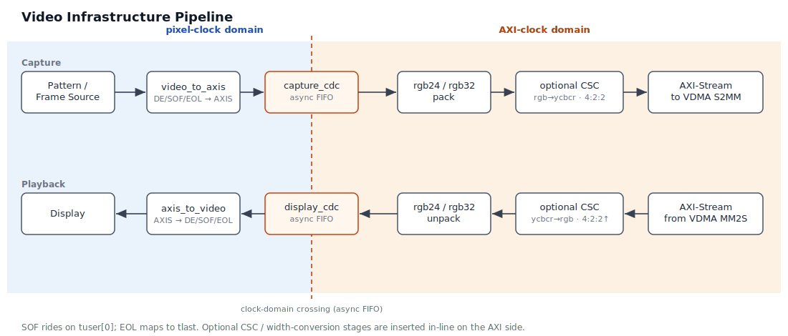

# Verilaxi — Developer Guide

**Project:** `verilaxi`
**Toolchain:** Verilator (SystemVerilog simulation)
**Interfaces:** AXI4-Full · AXI4-Lite · AXI4-Stream
**Engines:** S2MM · MM2S · MM2MM (CDMA)

---

## Table of Contents

1. [Project Overview](#1-project-overview)
2. [Repository Structure](#2-repository-structure)
3. [Module Reference](#3-module-reference)
   - 3.1 [DMA and CDMA Datapaths](#31-dma-and-cdma-datapaths)
   - 3.2 [UART and AXI-Lite Control Plane](#32-uart-and-axi-lite-control-plane)
   - 3.3 [AXI-Stream Infrastructure](#33-axi-stream-infrastructure)
   - 3.4 [Video Infrastructure](#34-video-infrastructure)
   - 3.5 [AXI Video DMA (VDMA)](#35-axi-video-dma-vdma)
4. [DMA, CDMA, and VDMA CSR Register Maps](#4-dma-cdma-and-vdma-csr-register-maps)
   - 4.1 [DMA Register Map (snix_axi_dma_csr)](#41-dma-register-map-snix_axi_dma_csr)
   - 4.2 [CDMA Register Map (snix_axi_cdma_csr)](#42-cdma-register-map-snix_axi_cdma_csr)
   - 4.3 [VDMA Register Map (snix_axi_vdma)](#43-vdma-register-map-snix_axi_vdma)
5. [DMA and CDMA External Interfaces](#5-dma-and-cdma-external-interfaces)
   - 5.1 [AXI-Lite Slave (Control)](#51-axi-lite-slave-control)
   - 5.2 [AXI4-Full Master — S2MM Write Channels](#52-axi4-full-master--s2mm-write-channels)
   - 5.3 [AXI4-Full Master — MM2S Read Channels](#53-axi4-full-master--mm2s-read-channels)
   - 5.4 [AXI4-Stream Slave (S2MM Input)](#54-axi4-stream-slave-s2mm-input)
   - 5.5 [AXI4-Stream Master (MM2S Output)](#55-axi4-stream-master-mm2s-output)
   - 5.6 [AXI4-Full Master — CDMA MM2MM Port](#56-axi4-full-master--cdma-mm2mm-port)
6. [Verification IP (VIP) Reference](#6-verification-ip-vip-reference)
   - 6.1 [Package Overview](#61-package-overview)
   - 6.2 [axil_master](#62-axil_master)
   - 6.3 [axis_source](#63-axis_source)
   - 6.4 [axis_sink](#64-axis_sink)
   - 6.5 [axi_slave](#65-axi_slave)
   - 6.6 [axi_dma_driver](#66-axi_dma_driver)
   - 6.7 [axi_cdma_driver](#67-axi_cdma_driver)
7. [Simulation Guide](#7-simulation-guide)
   - 7.1 [Prerequisites](#71-prerequisites)
   - 7.2 [Running Tests](#72-running-tests)
   - 7.3 [Viewing Waveforms](#73-viewing-waveforms)
   - 7.4 [Writing a New Test](#74-writing-a-new-test)
   - 7.5 [SVA Protocol Checkers](#75-sva-protocol-checkers)
8. [FSM State Diagrams](#8-fsm-state-diagrams)
9. [Design Notes](#9-design-notes)

---

## 1. Project Overview

**Verilaxi** is a synthesisable AXI DMA subsystem with a self-contained Verilator-based verification environment. It also includes reusable AXI-Stream infrastructure blocks for stream pipelining, arbitration, buffering, clock-domain crossing, and width conversion:

- `snix_axis_register`, `snix_axis_fifo`, `snix_axis_afifo` — register slice, sync/async FIFO
- `snix_axis_arbiter` — packet, beat, and weighted round-robin arbitration
- `snix_axis_upsizer`, `snix_axis_downsizer` — integer-ratio width converters (k:1 and 1:k)
- `snix_axis_rr_converter`, `snix_axis_rr_upsizer`, `snix_axis_rr_downsizer` — rational-ratio width converters (e.g. 16↔24, 32↔48)

It contains two top-level DMA IP blocks:

**`snix_axi_dma` — Streaming DMA** moves data between an AXI4-Stream interface and AXI4-Full memory using two independent engines:

- **S2MM** (Stream-to-Memory-Mapped) — receives an AXI-Stream and writes it to memory via AXI4 write channels.
- **MM2S** (Memory-Mapped-to-Stream) — reads from memory via AXI4 read channels and produces an AXI-Stream.

Both engines are configured through an AXI-Lite register interface and share a common register block (`snix_axi_dma_csr`). Each engine has an internal AXI-Stream FIFO that decouples the stream-side datapath from the memory-side burst engine.


**`snix_axi_cdma` — Central DMA** performs memory-to-memory copies over a single AXI4-Full port with no stream interfaces:

- **MM2MM** (Memory-Mapped-to-Memory-Mapped) — reads a contiguous block from a source address and writes it to a destination address, handling 4KB boundary splitting and partial last-beat strobes automatically.


## 2. Repository Structure

```
verilaxi/
├── Makefile                  Top-level build entry point
├── mk/
│   ├── config.mk             Test names, paths, Verilator flags
│   ├── build.mk              Verilator compile & run targets
│   ├── menu.mk               Interactive test menu
│   └── help.mk               Help text
├── filelists/
│   ├── common.f              RTL + shared TB file list
│   └── tb_top.f              Testbench top file list
├── rtl/
│   ├── axi/
│   │   ├── snix_axi_dma.sv   Top-level streaming DMA (S2MM + MM2S + CSR)
│   │   ├── snix_axi_s2mm.sv  Stream-to-Memory engine
│   │   ├── snix_axi_mm2s.sv  Memory-to-Stream engine
│   │   ├── snix_axi_cdma.sv  Top-level Central DMA (MM2MM + CSR)
│   │   └── snix_axi_mm2mm.sv Memory-to-Memory engine
│   ├── axil/
│   │   ├── snix_axi_dma_csr.sv   AXI-Lite register file (DMA)
│   │   ├── snix_axi_cdma_csr.sv  AXI-Lite register file (CDMA)
│   │   ├── snix_axil_register.sv
│   │   ├── snix_axil_gpio.sv      AXI-Lite GPIO with LEDs, RGB LEDs, and debounced buttons
│   │   ├── snix_uart_axil_slave.sv   AXI-Lite UART peripheral
│   │   └── snix_uart_axil_master.sv  UART-to-AXI-Lite bridge
│   ├── axis/
│   │   ├── snix_axis_arbiter.sv      AXI-Stream packet/beat/weighted arbiter
│   │   ├── snix_axis_fifo.sv         AXI-Stream FIFO wrapper
│   │   ├── snix_axis_afifo.sv        AXI-Stream async FIFO / CDC wrapper
│   │   ├── snix_axis_register.sv
│   │   ├── snix_axis_upsizer.sv      Integer width upsizer  (k:1, e.g. 8→32)
│   │   ├── snix_axis_downsizer.sv    Integer width downsizer (1:k, e.g. 32→8)
│   │   ├── snix_axis_rr_converter.sv Rational-ratio width converter (e.g. 32↔48)
│   │   ├── snix_axis_rr_upsizer.sv   Rational-ratio upsizer wrapper (enforces OUT>IN)
│   │   └── snix_axis_rr_downsizer.sv Rational-ratio downsizer wrapper (enforces IN>OUT)
│   ├── uart/
│   │   └── snix_uart_lite.sv         8N1 UART core with byte FIFOs
│   └── common/
│       ├── snix_sync_fifo.sv    Synchronous FIFO primitive
│       ├── snix_async_fifo.sv   Asynchronous FIFO primitive
│       └── snix_register_slice.sv
├── tb/
│   ├── packages/
│   │   ├── axi_pkg.sv        Packages all VIP classes
│   │   ├── axi_dma_pkg.sv    DMA driver class + CSR constants
│   │   └── axi_cdma_pkg.sv   CDMA driver class + CSR constants
│   ├── interfaces/
│   │   ├── axi_if.sv         AXI4-Full interface
│   │   ├── axil_if.sv        AXI4-Lite interface
│   │   └── axis_if.sv        AXI4-Stream interface
│   ├── classes/
│   │   ├── axi/              axi_master, axi_slave, axi_driver
│   │   ├── axil/             axil_master, axil_slave, axil_driver
│   │   └── axis/             axis_source, axis_sink, axis_connect, axis_driver
│   ├── assertions/
│   │   ├── axis_checker.sv   AXI-Stream SVA checker (4 rules)
│   │   ├── axil_checker.sv   AXI-Lite SVA checker (5 rules)
│   │   ├── axi_mm_checker.sv AXI4-Full SVA checker (7 rules)
│   │   └── axi_4k_checker.sv AXI4 4KB burst-boundary checker
│   ├── tests/
│   │   ├── axi/              test_dma.sv (DMA integration), test_cdma.sv (CDMA integration)
│   │   ├── axil/             test_axil_register.sv, test_axil_gpio.sv, test_uart_axil_slave.sv, test_uart_axil_master.sv
│   │   ├── axis/             test_axis_fifo.sv, test_axis_afifo.sv, test_axis_register.sv
│                         test_axis_upsizer.sv, test_axis_downsizer.sv
│                         test_axis_rr_converter.sv, test_axis_rr_upsizer.sv, test_axis_rr_downsizer.sv
│   │   └── uart/             test_uart_lite.sv
│   └── top/
│       └── testbench.sv      Top-level testbench (compile-time test select)
├── tb_cpp/
│   └── sim_main.cpp          Verilator C++ entry point
└── work/
    ├── logs/                 Simulation logs per test
    └── waves/                FST waveform files per test
```

---

## 3. Module Reference

This section is organised by functional family so the DMA datapaths, their CSRs, and the surrounding control-plane blocks stay close together.

### 3.1 DMA and CDMA Datapaths

#### `snix_axi_dma` — Top-Level DMA

**File:** `rtl/axi/snix_axi_dma.sv`

**Background article:** [AXI DMA: Moving Data Without the CPU](https://sistenix.com/axi_dma.html)

The integration wrapper that instantiates and wires together the CSR, S2MM engine, and MM2S engine.

**Parameters**

| Parameter        | Default | Description                          |
|------------------|---------|--------------------------------------|
| `ADDR_WIDTH`     | 32      | AXI4-Full address width (bits)       |
| `DATA_WIDTH`     | 64      | AXI4-Full / Stream data width (bits) |
| `AXIL_ADDR_WIDTH`| 32      | AXI-Lite address width (bits)        |
| `AXIL_DATA_WIDTH`| 32      | AXI-Lite data width (bits)           |
| `ID_WIDTH`       | 4       | AXI ID width (bits)                  |
| `USER_WIDTH`     | 1       | AXI USER sideband width (bits)       |

**Internal constants**

| Constant          | Value | Description                             |
|-------------------|-------|-----------------------------------------|
| `NUM_REGS`        | 16    | Total register slots in CSR bank        |
| `FIFO_DEPTH_S2MM` | 16    | FIFO depth for the S2MM engine          |
| `FIFO_DEPTH_MM2S` | 16    | FIFO depth for the MM2S engine          |

**Connectivity summary**
The top level decodes the CSR output bus (`config_status_reg`) to individual control signals and drives them into the two engines. The engines' `ctrl_wr_done` / `ctrl_rd_done` pulses are fed back into the CSR's `read_status_reg` input so the STATUS register is updated in hardware.

---

#### `snix_axi_s2mm` — Stream-to-Memory Engine

**File:** `rtl/axi/snix_axi_s2mm.sv`

Receives data from an AXI4-Stream slave port and writes it to memory using AXI4-Full write channels (AW · W · B). Features include:

- **4K boundary compliance** — burst length is automatically clipped at 4 KB page boundaries.
- **Two-stage burst pipeline** (PREP1 → PREP2) to keep critical-path combinational depth minimal.
- **Circular mode** — on completion the engine immediately reloads the base address and transfer length from the control inputs and restarts, enabling continuous ring-buffer operation.
- **Abort** — asserting `ctrl_wr_stop` causes the FSM to return to IDLE at the next safe point.
- **Partial write strobe** — the last beat of a transfer uses a byte-accurate `wstrb` mask so only valid bytes are committed to memory.
- **Single-cycle done pulse** — `ctrl_wr_done` fires for exactly one clock cycle when the FSM transitions into IDLE (whether on completion or abort).

**Parameters** — same set as the top-level (`ADDR_WIDTH`, `DATA_WIDTH`, `ID_WIDTH`, `USER_WIDTH`, `FIFO_DEPTH`).

**FSM states**

| State       | Description                                              |
|-------------|----------------------------------------------------------|
| `IDLE`      | Waiting for `ctrl_wr_start` assertion                   |
| `PREP1`     | Stage 1 of burst calculation: 4K boundary check         |
| `PREP2`     | Stage 2: final `awlen` and `burst_actual_bytes` latched  |
| `AW`        | AW channel handshake; address/byte counters updated      |
| `WRITE`     | W channel beats transferred from internal FIFO           |
| `WAIT_BRESP`| Waiting for B-channel response; decides loop or stop     |

**Static AXI attributes** — the engine always issues INCR bursts (`awburst = 2'b01`), with `awid`, `awlock`, `awcache`, `awprot`, `awqos`, and `awuser` all tied to zero.

---

#### `snix_axi_mm2s` — Memory-to-Stream Engine

**File:** `rtl/axi/snix_axi_mm2s.sv`

Reads data from memory using AXI4-Full read channels (AR · R) and forwards it to an AXI4-Stream master port. Features mirror the S2MM engine:

- **4K boundary compliance** with identical two-stage PREP pipeline.
- **Transfer length alignment** — the requested byte count is rounded up to the next beat boundary (determined by `ctrl_rd_size`) because AXI reads always return full beats.
- **Circular mode** with seamless restart on completion.
- **Abort** on `ctrl_rd_stop` assertion.
- **R-channel gating** — `mm2s_rready` is only asserted when the FSM is in the `READ` state, preventing spurious data capture if the interconnect responds in the same cycle as `arready`.
- **Single-cycle done pulse** on FSM → IDLE transition.

**Parameters** — identical to S2MM.

**FSM states**

| State       | Description                                              |
|-------------|----------------------------------------------------------|
| `IDLE`      | Waiting for `ctrl_rd_start` assertion                   |
| `PREP1`     | Stage 1: 4K boundary check                              |
| `PREP2`     | Stage 2: final `arlen` and `burst_actual_bytes` latched  |
| `AR`        | AR channel handshake; address/byte counters updated      |
| `READ`      | R-channel data accepted into internal FIFO               |
| `WAIT_RRESP`| All beats received; decides loop or stop                 |

**Static AXI attributes** — INCR bursts (`arburst = 2'b01`); `arid`, `arlock`, `arcache`, `arprot`, `arqos`, and `aruser` tied to zero.

---

#### `snix_axi_dma_csr` — DMA Control & Status Registers

**File:** `rtl/axil/snix_axi_dma_csr.sv`

**Background article:** [Writing a CSR Block Using AXI-Lite](https://sistenix.com/axi_csr.html)

An AXI-Lite slave register file that provides the software-visible control and status interface for the DMA.

**Parameters**

| Parameter   | Default | Description                     |
|-------------|---------|---------------------------------|
| `DATA_WIDTH`| 32      | Register (and AXI-Lite) width   |
| `ADDR_WIDTH`| 4       | AXI-Lite address bus width      |
| `NUM_REGS`  | 16      | Number of 32-bit register slots |

**Key behaviours**

- Write and read address channels are each buffered by a `snix_register_slice` to improve timing closure.
- `ctrl_wr_start`, `ctrl_wr_stop`, `ctrl_rd_start`, `ctrl_rd_stop` are **self-clearing** — the CSR clears bits `[0]` and `[1]` of `WR_CTRL` / `RD_CTRL` one cycle after they are written, so software writes a pulse rather than a level.
- STATUS bits `[0]` (`wr_done`) and `[1]` (`rd_done`) are **sticky** — they latch the one-cycle done pulses from the engines and remain set until software writes `0` to clear them.
- All responses are `OKAY` (`bresp` / `rresp` = `2'b00`).

---

### 3.2 UART and AXI-Lite Control Plane

#### `snix_uart_lite` — Byte-Oriented UART Core

**File:** `rtl/uart/snix_uart_lite.sv`

An 8N1 UART core intended as the reusable serial building block for both standalone board bring-up and the AXI-Lite control-plane wrappers in this repository.

**Parameters**

| Parameter     | Default     | Description                               |
|---------------|-------------|-------------------------------------------|
| `CLK_FREQ_HZ` | 100_000_000 | Input clock frequency in hertz            |
| `BAUD_RATE`   | 115200      | UART baud rate                            |
| `FIFO_DEPTH`  | 8           | Number of byte entries in TX and RX FIFOs |

**Key behaviours**

- Implements standard 8N1 framing with one start bit, eight data bits, and one stop bit.
- RX and TX each use a small internal byte FIFO so the surrounding logic is decoupled from the serial bit timing.
- The external interface is byte-oriented: `tx_data/tx_valid/tx_ready` for transmit and `rx_data/rx_valid/rx_ready` for receive.
- `tx_busy` and `rx_busy` expose the in-flight serializer and sampler activity, which is useful for debug and simple status reporting.

**Verification hooks**

- `test_uart_lite.sv` loops the UART output back into the receiver and checks byte-accurate round-trip transfer for representative values such as `0x55`, `0xA3`, `0x00`, and `0xFF`.

---

#### `snix_axil_gpio` — AXI-Lite GPIO Peripheral

**File:** `rtl/axil/snix_axil_gpio.sv`

A lightweight GPIO peripheral for board bring-up, intended to sit behind either a CPU or the UART-to-AXI-Lite bridge. It exposes user LED outputs, two RGB LED outputs, synchronized switch inputs, debounced button inputs, and sticky button edge capture.


**Register map**

| Offset | Name       | Access | Description |
|--------|------------|--------|-------------|
| `0x00` | `GPIO_OUT` | `RW`   | Low bits drive the LED outputs |
| `0x04` | `GPIO_IN`  | `RO`   | Low bits return synchronized switches, next bits return debounced buttons |
| `0x08` | `BTN_EDGE` | `RW1C` | Sticky button rising-edge bits; write `1` to clear |
| `0x0C` | `RGB0_CTRL`| `RW`   | Low three bits drive the three on/off channels of RGB LED 0 |
| `0x10` | `RGB1_CTRL`| `RW`   | Low three bits drive the three on/off channels of RGB LED 1 |

**Key behaviours**

- Switches and buttons are first synchronized into the local clock domain before any control logic sees them.
- Buttons are debounced with a per-button counter, so short bounce bursts do not create false transitions.
- `BTN_EDGE` latches debounced rising edges and holds them until software clears the corresponding bit.
- The block is intentionally simple enough for direct use on boards such as the Arty S7-50, where user LEDs, RGB LEDs, switches, and buttons are often the first peripherals brought up.
- RGB outputs are plain on/off control bits, not PWM brightness channels, so the peripheral stays small and easy to verify.

**Verification hooks**

- `test_axil_gpio.sv` writes user LED and RGB LED outputs, reads synchronized switches, drives a bouncing button waveform, checks the debounced button state in `GPIO_IN`, and verifies sticky-edge capture plus write-one-to-clear behavior in `BTN_EDGE`.

---

#### `snix_uart_axil_slave` — AXI-Lite UART Peripheral

**File:** `rtl/axil/snix_uart_axil_slave.sv`

An AXI-Lite slave wrapper around `snix_uart_lite`, intended for CPU-controlled systems or for exposing a simple memory-mapped UART in larger AXI-Lite fabrics.

**Register map**

| Offset | Name     | Access | Description |
|--------|----------|--------|-------------|
| `0x00` | `DATA`   | `RW`   | Write low byte to TX FIFO; read low byte from RX FIFO |
| `0x04` | `STATUS` | `RO`   | Bit `[0]` `tx_ready`, bit `[1]` `rx_valid`, bit `[2]` `tx_busy`, bit `[3]` `rx_busy` |

**Key behaviours**

- AXI-Lite address and data channels are timing-isolated with `snix_register_slice`.
- Writes to `DATA` wait until the UART can accept a byte, so software sees a normal AXI-Lite backpressure event instead of silently dropping transmit data.
- Reads from `DATA` pop one received byte when `rx_valid` is asserted.
- `STATUS` is live state, not a sticky interrupt register; software can poll it for simple bring-up flows.

**Verification hooks**

- `test_uart_axil_slave.sv` writes bytes through AXI-Lite, loops `uart_tx` back to `uart_rx`, polls the `STATUS` register, and checks that the same bytes are returned through `DATA`.

---

#### `snix_uart_axil_master` — UART-to-AXI-Lite Bridge

**File:** `rtl/axil/snix_uart_axil_master.sv`

A synthesizable UART command bridge that turns a serial byte stream into AXI-Lite master transactions. This is the key no-CPU control-plane block for board bring-up on platforms such as the Arty S7-50.

**Command format**

- Write: `W <addr32hex> <data32hex>\n`
- Read: `R <addr32hex>\n`

**Responses**

- Successful write: `OK\n`
- Successful read: `D <addr32hex> <data32hex>\n`
- Parse or transaction error: `ERR\n`

**Key behaviours**

- Uses `snix_uart_lite` internally and parses ASCII hex commands with a small FSM.
- Issues one AXI-Lite transaction at a time and waits for the full `B` or `R` response before emitting the UART reply.
- Keeps the command format intentionally human-readable so a terminal emulator or a tiny host Python script can drive AXI-Lite peripherals without any embedded CPU.

**Verification hooks**

- `test_uart_axil_master.sv` connects a second UART instance as the host, sends read and write commands, and checks both the AXI-Lite side effects and the returned ASCII responses.

---

### 3.3 AXI-Stream Infrastructure

#### `snix_axis_fifo` — AXI-Stream FIFO

**File:** `rtl/axis/snix_axis_fifo.sv`

**Background article:** [Synchronous and Asynchronous FIFOs](https://sistenix.com/fifo_cdc.html)

An AXI4-Stream-compliant synchronous FIFO, used internally by both the S2MM and MM2S engines to decouple the stream and memory-bus datapaths.

**Parameters**

| Parameter   | Default | Description                        |
|-------------|---------|------------------------------------|
| `DATA_WIDTH`| 32      | Bit width of `tdata`               |
| `USER_WIDTH`| 1       | Bit width of `tuser`               |
| `FIFO_DEPTH`| 16      | Number of entries (must be power of 2) |

**Behaviour** — `s_axis_tready` is de-asserted whenever the internal `snix_sync_fifo` is full; `m_axis_tvalid` is asserted whenever data is available. The module packs `{tdata, tuser, tlast}` into a single wide word for the underlying FIFO primitive.

---

#### `snix_axis_arbiter` — AXI-Stream Arbiter

**File:** `rtl/axis/snix_axis_arbiter.sv`

**Background article:** [AXI-Stream Arbitration in SystemVerilog](https://sistenix.com/axi_arbiter.html)


An AXI4-Stream arbiter that supports three closely related policies in the same RTL:

- **packet round-robin** — hold the current grant until `TLAST`
- **beat round-robin** — rotate after every accepted beat
- **weighted packet round-robin** — round-robin order constrained by per-source credits

**Parameters**

| Parameter    | Default | Description                                                    |
|--------------|---------|----------------------------------------------------------------|
| `NUM_SRCS`   | 4       | Number of AXI-Stream sources                                   |
| `DATA_WIDTH` | 8       | Bit width of `tdata`                                           |
| `USER_WIDTH` | 1       | Bit width of `tuser`                                           |
| `HOLD_PACKET`| 1       | `1` = packet mode, `0` = beat mode                             |
| `WEIGHT_W`   | 4       | Bit width of each packed weight field                          |
| `WEIGHTS`    | `'0`    | Packed `{W[N-1], ..., W1, W0}` service weights                 |

**Key behaviours**

- The combinational scan starts at `rr_ptr` and wraps around with modular arithmetic, so the previous winner is not immediately reconsidered first.
- `locked` has a dual role: it holds a selected source stable while a beat is stalled, and in packet mode it extends that hold across all beats of a multi-beat packet.
- `HOLD_PACKET=1'b1` keeps the grant until `TVALID && TREADY && TLAST`; `HOLD_PACKET=1'b0` makes the same state machine rotate on every accepted beat.
- `WEIGHTS` are packed with source 0 in the least-significant slice. A configured weight of zero is treated as one by the `cfg_weight()` helper, so the default `'0` naturally becomes equal round-robin.
- Only the effective selected source sees `s_axis_tready=1`; all others are backpressured.

**Verification hooks**

- `test_axis_arbiter.sv` checks packet-mode arbitration in both sequential and concurrent traffic phases and closes with `72` beats and `16` packets.
- `test_axis_arbiter_beat.sv` checks strict `0,1,2,3,...` accepted-beat rotation when backpressure is disabled.
- `test_axis_arbiter_weighted.sv` checks exact grant ratios for a packed weight configuration such as `{W3, W2, W1, W0} = {1,1,2,4}`.

---

#### `snix_axis_afifo` — AXI-Stream Async FIFO

**File:** `rtl/axis/snix_axis_afifo.sv`

**Background article:** [Synchronous and Asynchronous FIFOs](https://sistenix.com/fifo_cdc.html)

An AXI4-Stream asynchronous FIFO for clock-domain crossing between independent source and sink clocks. It transports `tdata` and `tlast` through `snix_async_fifo` and exposes separate `s_axis_clk` and `m_axis_clk` domains. It does not have a native `tuser` port; wrappers that need sideband metadata, such as video SOF, should pack that metadata into `tdata` before the CDC boundary and unpack it afterward.


**Parameters**

| Parameter    | Default | Description                                                      |
|--------------|---------|------------------------------------------------------------------|
| `DATA_WIDTH` | 32      | Bit width of `tdata`                                             |
| `FIFO_DEPTH` | 16      | Number of entries (must be power of 2)                           |
| `FRAME_FIFO` | 0       | `0` = streaming/cut-through, `1` = frame-aware store-and-forward |

**Behaviour**

- In **streaming mode** (`FRAME_FIFO=0`), the output side may begin draining as soon as entries are available in the async FIFO.
- In **frame mode** (`FRAME_FIFO=1`), the read side waits until a complete packet has been written before asserting output valid, so frames are emitted atomically.
- Frame completion crosses from the write clock domain to the read clock domain using a toggle-based event synchroniser, which avoids missing a one-cycle packet-done pulse when the two clocks are asynchronous.

---


*Figure: Rational-ratio AXI-Stream width-converter wrappers in verilaxi. The top path is snix_axis_rr_upsizer (narrow to wide) and the bottom path is snix_axis_rr_downsizer (wide to narrow).*

**Background article:** [Building AXI-Stream Width Converters](https://sistenix.com/axis_width_converter.html)

#### `snix_axis_upsizer` — Integer Width Upsizer

**File:** `rtl/axis/snix_axis_upsizer.sv`

Assembles `RATIO` consecutive narrow input beats into one wide output beat. The ratio must be an exact integer (`OUT_DATA_WIDTH` must be a multiple of `IN_DATA_WIDTH`).

**Parameters**

| Parameter       | Default | Description                                          |
|-----------------|---------|------------------------------------------------------|
| `IN_DATA_WIDTH` | 8       | Narrow-side width in bits (multiple of 8)            |
| `OUT_DATA_WIDTH`| 32      | Wide-side width; must equal `N × IN_DATA_WIDTH`, N≥2 |

**Key behaviours**

- `RATIO = OUT_DATA_WIDTH / IN_DATA_WIDTH` is computed as a localparam.
- A phase counter (`phase`) tracks how many narrow beats have been accepted.
- Each accepted narrow beat is written into the `buf_data[phase]` and `buf_keep[phase]` arrays; a combinational assembly block (`always_comb`) builds the full wide word from the buffer plus the current input beat.
- When `phase == RATIO − 1` (last slot) **or** `s_axis_tlast` fires, the assembled word is latched into an output holding register (`r_tdata`, `r_tkeep`, `r_tlast`, `r_tvalid`).
- `s_axis_tready = !r_tvalid || m_axis_tready` — the upstream source can send a new beat in the same cycle that the downstream sink consumes the output register, giving one-cycle pipeline overlap.
- TKEEP on the final output beat: all lanes from the last valid input phase are packed; trailing invalid lanes are zeroed.

**FSM / flow summary**

```
FILL: accept narrow beats → buffer
      when phase == RATIO-1 or TLAST: latch output register, phase reset
OUTPUT: r_tvalid drives m_axis_tvalid
        consumed when m_axis_tready && m_axis_tvalid
```

**Verification** — `test_axis_upsizer.sv` uses IN=8, OUT=32 (RATIO=4). Sends packets of 1, 2, 3, 4 beats; checks 8 output beats, 8 packets, and TKEEP values `0001 / 0011 / 0111 / 1111` (×2 with and without backpressure).

---

#### `snix_axis_downsizer` — Integer Width Downsizer

**File:** `rtl/axis/snix_axis_downsizer.sv`

Splits one wide input beat into `RATIO` consecutive narrow output beats. The ratio must be an exact integer (`IN_DATA_WIDTH` must be a multiple of `OUT_DATA_WIDTH`).

**Parameters**

| Parameter       | Default | Description                                              |
|-----------------|---------|----------------------------------------------------------|
| `IN_DATA_WIDTH` | 32      | Wide-side width in bits (multiple of 8)                  |
| `OUT_DATA_WIDTH`| 8       | Narrow-side width; must divide `IN_DATA_WIDTH` exactly   |

**Key behaviours**

- `RATIO = IN_DATA_WIDTH / OUT_DATA_WIDTH` is computed as a localparam.
- **IDLE/BURST FSM**: in IDLE the module accepts one wide beat (latches `latch_data`, `latch_keep`, `latch_last`) and transitions to BURST; in BURST it streams RATIO narrow beats combinationally from the latch, then returns to IDLE.
- `s_axis_tready` is high only in IDLE; `m_axis_tvalid` is high only in BURST.
- `last_phase` is computed during IDLE from the input TKEEP: the highest set byte-enable lane determines how many narrow beats are valid. TLAST is asserted when `phase == last_phase`.
- Combinational output: `m_axis_tdata = latch_data[phase*OUT_DATA_WIDTH +: OUT_DATA_WIDTH]`.

**Verification** — `test_axis_downsizer.sv` uses IN=32, OUT=8 (RATIO=4). Sends 1, 2, 3, 4-beat packets twice; checks 80 output beats and 8 packets with correct TKEEP on each TLAST beat.

---

#### `snix_axis_rr_converter` — Rational-Ratio Width Converter

**File:** `rtl/axis/snix_axis_rr_converter.sv`

Converts between any two byte-aligned widths whose ratio is not an integer. Uses the LCM-buffer approach: collect `IN_RATIO` input beats into a buffer of `LCM_W` bits, then drain `OUT_RATIO` output beats from it. Works in both directions (upsize and downsize) with the same RTL.

**Parameters**

| Parameter       | Default | Description                                        |
|-----------------|---------|---------------------------------------------------|
| `IN_DATA_WIDTH` | 32      | Input bus width in bits (multiple of 8)            |
| `OUT_DATA_WIDTH`| 48      | Output bus width in bits (multiple of 8)           |

**Derived localparams**

| Localparam  | Formula                           | Example (32→48)  |
|-------------|-----------------------------------|------------------|
| `G`         | `GCD(IN_DATA_WIDTH, OUT_DATA_WIDTH)` | 16            |
| `IN_RATIO`  | `OUT_DATA_WIDTH / G`              | 3                |
| `OUT_RATIO` | `IN_DATA_WIDTH / G`               | 2                |
| `LCM_W`     | `IN_DATA_WIDTH × IN_RATIO`        | 96               |

GCD is computed at elaboration time by `gcd_fn`, a traditional Verilog-style function (no `return`, no `break`) that is compatible with both Verilator and Yosys.

**FILL/DRAIN FSM**

| State  | Behaviour                                                                           |
|--------|--------------------------------------------------------------------------------------|
| `FILL` | `s_axis_tready=1`. Accepts input beats into `lcm_buf`. Transitions to DRAIN when `in_phase == IN_RATIO−1` or `s_axis_tlast` fires. |
| `DRAIN`| `m_axis_tvalid=1`. Streams output beats from `lcm_buf`. Returns to FILL when `out_phase == last_out_phase`. |

**TLAST / TKEEP**

When TLAST arrives at input beat P (0-based):
- `total_bytes = (P+1) × IN_BYTES`
- `last_out_phase = ⌈total_bytes / OUT_BYTES⌉ − 1`
- `last_tkeep`: low `rem` bits set, where `rem = total_bytes mod OUT_BYTES`; if `rem == 0` all lanes are valid

These are pre-computed at elaboration time using a `generate` loop indexed by the `IN_RATIO` possible values of `in_phase`, so the synthesised hardware is a small MUX — not a divider.

**Synthesis note** — On Yosys 0.66, the `gcd_fn` function uses `gcd_fn = a` instead of `return a` and an `if (b != 0)` conditional body instead of `break`, for compatibility. The TLAST LUT uses a `generate for` loop with localparam arithmetic so all division/modulo is resolved at elaboration time (avoids the ~10 000-cell Artix-7 explosion that results from synthesising a 32-bit hardware divider).

**Verification** — `test_axis_rr_converter.sv` uses IN=16, OUT=24. Exercises packets of 3, 1, 2, 6 input beats; checks 18 output beats, 8 packets, and TKEEP `111 / 011 / 001 / 111` per packet (×2 phases).

---

#### `snix_axis_rr_upsizer` — Rational-Ratio Upsizer

**File:** `rtl/axis/snix_axis_rr_upsizer.sv`

Thin wrapper around `snix_axis_rr_converter` that enforces `OUT_DATA_WIDTH > IN_DATA_WIDTH`. Use this module in preference to the bare converter when the upsize direction is part of your interface contract.

**Parameters**

| Parameter       | Default | Description                                          |
|-----------------|---------|------------------------------------------------------|
| `IN_DATA_WIDTH` | 16      | Narrow-side input width in bits                      |
| `OUT_DATA_WIDTH`| 24      | Wide-side output width; must be > `IN_DATA_WIDTH`    |

An elaboration-time `$fatal` fires if `OUT_DATA_WIDTH ≤ IN_DATA_WIDTH`. For integer ratios (where `OUT` is exactly divisible by `IN`) prefer `snix_axis_upsizer`, which can overlap input and output without stalling.

**Verification** — `test_axis_rr_upsizer.sv`: IN=16, OUT=24 (G=8, IN_RATIO=3, OUT_RATIO=2, LCM=48). Same packet sequence as the rr_converter test; 18 output beats, 8 packets.

---

#### `snix_axis_rr_downsizer` — Rational-Ratio Downsizer

**File:** `rtl/axis/snix_axis_rr_downsizer.sv`

Thin wrapper around `snix_axis_rr_converter` that enforces `IN_DATA_WIDTH > OUT_DATA_WIDTH`. Use this when the downsize direction is part of your interface contract.

**Parameters**

| Parameter       | Default | Description                                          |
|-----------------|---------|------------------------------------------------------|
| `IN_DATA_WIDTH` | 24      | Wide-side input width in bits                        |
| `OUT_DATA_WIDTH`| 16      | Narrow-side output width; must be < `IN_DATA_WIDTH`  |

An elaboration-time `$fatal` fires if `IN_DATA_WIDTH ≤ OUT_DATA_WIDTH`. For integer ratios prefer `snix_axis_downsizer`.

**Verification** — `test_axis_rr_downsizer.sv`: IN=24, OUT=16 (G=8, IN_RATIO=2, OUT_RATIO=3, LCM=48). Packets of 2, 1, 2, 4 input beats → 3, 2, 3, 6 output beats; 28 output beats, 8 packets, TKEEP `11 / 01 / 11 / 11` per packet (×2 phases).

---

**Width converter selection guide**

| Condition | Module |
|-----------|--------|
| `OUT = N × IN` (integer upsize) | `snix_axis_upsizer` |
| `IN = N × OUT` (integer downsize) | `snix_axis_downsizer` |
| Non-integer ratio, OUT > IN | `snix_axis_rr_upsizer` |
| Non-integer ratio, IN > OUT | `snix_axis_rr_downsizer` |
| Either direction, ratio unknown | `snix_axis_rr_converter` |

---

#### `snix_axi_mm2mm` — Memory-to-Memory Engine

**File:** `rtl/axi/snix_axi_mm2mm.sv`

Reads a contiguous block from a source address and writes it to a destination address over a single shared AXI4-Full port. There are no stream interfaces; all data movement is internal via an `snix_axis_fifo` that bridges the read and write paths.

- **4K boundary compliance** — both the read (AR) and write (AW) address pointers are split at 4 KB boundaries using the same two-stage PREP pipeline as S2MM/MM2S.
- **Single AXI port** — read and write channels share one AXI4 connection. The FSM serialises them: read burst completes fully before the write burst begins.
- **Partial write strobe** — the last beat of the final write burst uses a byte-accurate `wstrb` mask.
- **Abort** — asserting `ctrl_stop` causes the FSM to return to IDLE after the current B-channel response.
- **Single-cycle done pulse** — `ctrl_done` fires for one clock cycle on FSM → IDLE.

**Parameters** — `ADDR_WIDTH`, `DATA_WIDTH`, `ID_WIDTH`, `USER_WIDTH`, `FIFO_DEPTH`.

**FSM states**

| State        | Description                                                         |
|--------------|---------------------------------------------------------------------|
| `IDLE`       | Waiting for `ctrl_start` rising edge                               |
| `PREP1`      | Stage 1: 4K boundary check (src address used for the check)        |
| `PREP2`      | Stage 2: `arlen`/`awlen` and `burst_actual_bytes` latched          |
| `AR`         | AR handshake; `src_axi_addr` and `pending_bytes` updated           |
| `READ`       | R-channel beats accepted into internal FIFO                        |
| `AW`         | AW handshake; `dst_axi_addr` and `copied_bytes` updated            |
| `WRITE`      | W-channel beats drained from internal FIFO                         |
| `WAIT_BRESP` | Waiting for B response; decides next burst or IDLE                 |

---

#### `snix_axi_cdma` — Top-Level Central DMA

**File:** `rtl/axi/snix_axi_cdma.sv`

**Background article:** [AXI DMA: Moving Data Without the CPU](https://sistenix.com/axi_dma.html)

Integration wrapper that instantiates `snix_axi_cdma_csr` and `snix_axi_mm2mm`.

**Parameters**

| Parameter         | Default | Description                          |
|-------------------|---------|--------------------------------------|
| `ADDR_WIDTH`      | 32      | AXI4-Full address width (bits)       |
| `DATA_WIDTH`      | 64      | AXI4-Full data width (bits)          |
| `AXIL_ADDR_WIDTH` | 32      | AXI-Lite address width (bits)        |
| `AXIL_DATA_WIDTH` | 32      | AXI-Lite data width (bits)           |
| `ID_WIDTH`        | 4       | AXI ID width (bits)                  |
| `USER_WIDTH`      | 1       | AXI USER sideband width (bits)       |

**Internal constants** — `FIFO_DEPTH = 16`, `NUM_REGS = 8`.

**Connectivity** — The top level decodes `config_status_reg` from the CSR into individual control signals (`ctrl_start`, `ctrl_stop`, `ctrl_size`, `ctrl_len`, `ctrl_transfer_len`, `ctrl_src_addr`, `ctrl_dst_addr`) and drives them into the MM2MM engine. The engine's `ctrl_done` pulse is fed back into `read_status_reg[0]` so STATUS is updated by hardware.

---

#### `snix_axi_cdma_csr` — CDMA Control & Status Registers

**File:** `rtl/axil/snix_axi_cdma_csr.sv`

AXI-Lite slave register file for the CDMA. Structure mirrors `snix_axi_dma_csr` but with a single-channel control path and two address registers.

**Key behaviours**

- `ctrl_start` (bit `[0]` of CDMA_CTRL) and `ctrl_stop` (bit `[1]`) are **self-clearing** — cleared one cycle after being written.
- STATUS register (`offset 0x10`) is **write-protected** — the CSR ignores AXI-Lite writes to that address. The done bit is set only by the `ctrl_done` pulse from the MM2MM engine.
- The done bit is **cleared automatically** when `ctrl_start` fires, so software does not need to manually clear STATUS before restarting.

---

### 3.4 Video Infrastructure

The video infrastructure provides a self-contained pipeline for transporting progressive video frames over AXI-Stream and into AXI4 memory. The modules follow a composable layered model: a timing generator drives the pixel clock grid, an adapter converts the native video bus to AXI-Stream, optional width converters and asynchronous FIFOs cross clock domains, and a symmetric adapter converts AXI-Stream back to native video for display.



#### `snix_video_pkg` — Video Timing Package

**File:** `rtl/video/snix_video_pkg.sv`

Defines the `video_timing_t` struct and pre-computed timing presets used by every video module.

**`video_timing_t` struct**

| Field            | Type           | Description                        |
|------------------|----------------|------------------------------------|
| `h_active`       | `int unsigned` | Active pixels per line             |
| `h_front_porch`  | `int unsigned` | Horizontal front porch (pixels)    |
| `h_sync_pulse`   | `int unsigned` | Horizontal sync pulse width        |
| `h_back_porch`   | `int unsigned` | Horizontal back porch (pixels)     |
| `v_active`       | `int unsigned` | Active lines per frame             |
| `v_front_porch`  | `int unsigned` | Vertical front porch (lines)       |
| `v_sync_pulse`   | `int unsigned` | Vertical sync pulse width          |
| `v_back_porch`   | `int unsigned` | Vertical back porch (lines)        |

**Timing presets**

| Constant              | Resolution  | Pixel clock       |
|-----------------------|-------------|-------------------|
| `TEST_8x4`            | 8×4         | — (protocol simulation only) |
| `TEST_16x8`           | 16×8        | —                 |
| `TEST_32x16`          | 32×16       | —                 |
| `TEST_64x32`          | 64×32       | —                 |
| `VGA_640x480`         | 640×480     | 25.175 MHz        |
| `HD_1280x720`         | 1280×720    | 74.25 MHz         |
| `FHD_1920x1080`       | 1920×1080   | 148.5 MHz         |
| `UHD_3840x2160`       | 3840×2160   | 594.0 MHz         |

The nominal pixel clock constants (`VGA_640x480_CLK_HZ` etc.) are `longint unsigned` localparams consumed by simulation clock generators and synthesis constraints; physical hardware must generate these with a PLL or MMCM.

---

#### `snix_video_timing_gen` — Video Timing Generator

**File:** `rtl/video/snix_video_timing_gen.sv`

Generates horizontal and vertical sync, active-video window, start-of-frame (SOF), and end-of-line (EOL) signals from a `video_timing_t` timing preset.

**Parameters**

| Parameter | Default        | Description                        |
|-----------|----------------|------------------------------------|
| `TIMING`  | `VGA_640x480`  | Timing preset (`video_timing_t`)   |

**Outputs**

| Port          | Description                                                    |
|---------------|----------------------------------------------------------------|
| `hsync`       | Horizontal sync pulse (active high, asserted during h_sync_pulse region) |
| `vsync`       | Vertical sync pulse (active high, asserted during v_sync_pulse region)   |
| `active_video`| High for every pixel within the active area                    |
| `sof`         | Single-cycle pulse at pixel (0,0) of each frame                |
| `eol`         | Single-cycle pulse at the last active pixel of each line       |
| `pixel_x`     | Current horizontal pixel counter (full H_TOTAL range)          |
| `pixel_y`     | Current vertical line counter (full V_TOTAL range)             |

Counters reset on `rst_n` deassertion. `pixel_x` wraps at `H_TOTAL − 1`; `pixel_y` increments at each line wrap and resets at `V_TOTAL − 1`.

---

#### `snix_video_pattern_gen` — Colour Bar Pattern Generator

**File:** `rtl/video/snix_video_pattern_gen.sv`

Combinational colour-bar generator that maps a pixel position to a 24-bit RGB colour. Useful for stand-alone simulation and board bring-up without an external frame source.

**Parameters**

| Parameter | Default       | Description                      |
|-----------|---------------|----------------------------------|
| `TIMING`  | `VGA_640x480` | Timing preset for bar division   |

**Behaviour**

The active area is divided into eight equal vertical bars. Bar index is computed as `(pixel_x × 8) / h_active`. Bars are assigned colours in EBU order: white → yellow → cyan → green → magenta → red → blue → black. Outside the active area, `pixel_data` is forced to `24'h000000`.

| Bar | Colour    | `pixel_data` |
|-----|-----------|-------------|
| 0   | White     | `0xFFFFFF`  |
| 1   | Yellow    | `0xFFFF00`  |
| 2   | Cyan      | `0x00FFFF`  |
| 3   | Green     | `0x00FF00`  |
| 4   | Magenta   | `0xFF00FF`  |
| 5   | Red       | `0xFF0000`  |
| 6   | Blue      | `0x0000FF`  |
| 7   | Black     | `0x000000`  |

---

#### `snix_video_to_axis` — Video-to-AXI-Stream Adapter

**File:** `rtl/video/snix_video_to_axis.sv`

Converts native parallel video (`video_de`, `video_sof`, `video_eol`, `video_data`) to AXI4-Stream. The conversion is combinational; no pipeline registers are inserted.

**Parameters**

| Parameter    | Default | Description                                   |
|--------------|---------|-----------------------------------------------|
| `DATA_WIDTH` | 24      | Video pixel / stream data width (bits)        |
| `USER_WIDTH` | 1       | AXI-Stream `tuser` width; `tuser[0]` carries SOF |

**Signal mapping**

| Video port    | AXI-Stream port  | Notes                                      |
|---------------|------------------|--------------------------------------------|
| `video_de`    | `m_axis_tvalid`  | Active-video enable drives valid           |
| `video_sof`   | `m_axis_tuser[0]`| Start-of-frame sideband                   |
| `video_eol`   | `m_axis_tlast`   | End-of-line marks each packet boundary    |
| `video_data`  | `m_axis_tdata`   | Raw pixel data, no re-ordering            |

**`overflow` flag** — native video sources cannot be backpressured. If `m_axis_tready` is low while `video_de` is high, the sticky `overflow` flag is set. A production design inserts `snix_video_capture_cdc` (or at minimum an async FIFO) immediately after this adapter so any backpressure from a downstream AXI clock domain is absorbed.

---

#### `snix_axis_to_video` — AXI-Stream-to-Video Adapter

**File:** `rtl/video/snix_axis_to_video.sv`

Converts AXI4-Stream back to native video, synchronised to an externally generated display timing reference.

**Parameters**

| Parameter    | Default  | Description                              |
|--------------|----------|------------------------------------------|
| `DATA_WIDTH` | 24       | Video pixel / stream data width (bits)   |
| `USER_WIDTH` | 1        | `tuser` width; `tuser[0]` = SOF          |
| `BLANK_DATA` | `'0`     | Pixel value driven during blanking       |

**Behaviour**

`s_axis_tready` is simply `timing_de` — the stream is consumed exactly when the display timing window is active. `video_de`, `video_sof`, and `video_eol` are derived from the timing inputs and stream valid state. `video_data` outputs `BLANK_DATA` during blanking or when the stream stalls.

Two sticky error flags are provided:

| Flag           | Condition                                                        |
|----------------|------------------------------------------------------------------|
| `underflow`    | `timing_de` asserted but `s_axis_tvalid` low — display demanded a pixel that the stream has not yet supplied |
| `frame_error`  | Accepted pixel has `tuser[0] ≠ timing_sof` or `tlast ≠ timing_eol` — SOF/EOL framing mismatch between stream and timing reference |

---

#### `snix_video_rgb24_pack` — RGB24 Packer

**File:** `rtl/video/snix_video_rgb24_pack.sv`

Packs a 24-bit-per-pixel AXI-Stream into a wider AXI bus word (e.g. 64-bit). Useful before writing a capture stream to an AXI4 memory port that uses a wider beat size.

**Parameters**

| Parameter       | Default | Description                             |
|-----------------|---------|-----------------------------------------|
| `OUT_DATA_WIDTH`| 64      | Output beat width (bits, multiple of 8) |

**Behaviour**

Wraps `snix_axis_rr_converter` with `IN_DATA_WIDTH=24` and the parameterised `OUT_DATA_WIDTH`. For a 24→64 conversion, the GCD is 8, giving `IN_RATIO=8` and `OUT_RATIO=3` — three 24-bit input pixels pack into one eight-byte output beat, producing a lossless byte-level mapping with accurate TKEEP on the final (possibly partial) beat.

SOF (`tuser[0]`) is propagated using a `sof_pending` latch: SOF arriving at the input side is captured and forwarded on the first output beat produced from that batch, since the rational-ratio converter may buffer multiple input beats before emitting an output.

---

#### `snix_video_rgb24_unpack` — RGB24 Unpacker

**File:** `rtl/video/snix_video_rgb24_unpack.sv`

Symmetric inverse of `snix_video_rgb24_pack`: splits a wide AXI memory word back into a 24-bit-per-pixel AXI-Stream. Used on the playback path before `snix_axis_to_video`.

**Parameters**

| Parameter      | Default | Description                          |
|----------------|---------|--------------------------------------|
| `IN_DATA_WIDTH`| 64      | Input beat width (bits)              |

SOF forwarding uses the same `sof_pending` latch approach as the packer.

---

#### `snix_video_capture_cdc` — Capture Clock-Domain Crossing

**File:** `rtl/video/snix_video_capture_cdc.sv`

Bridges the full capture pipeline from pixel clock to AXI clock domain in a single module.

**Parameters**

| Parameter    | Default | Description                               |
|--------------|---------|-------------------------------------------|
| `DATA_WIDTH` | 64      | AXI-side data width (bits); also sets pack output width |
| `FIFO_DEPTH` | 64      | Async FIFO depth (entries, power of 2)   |

**Internal pipeline**

```
[capture_clk]
  snix_video_rgb24_pack (24 → DATA_WIDTH)
        ↓
  snix_axis_afifo        (CDC: capture_clk → axi_clk)
        ↓
[axi_clk]
  {tuser, tkeep, tdata}  (m_axis_* output ports)
```

The async FIFO is instantiated with `DATA_WIDTH + KEEP_WIDTH + 1` bits to carry `tdata`, `tkeep`, and `tuser` as a single concatenated word. `tlast` is carried by the FIFO's native TLAST port.

---

#### `snix_video_display_cdc` — Display Clock-Domain Crossing

**File:** `rtl/video/snix_video_display_cdc.sv`

Symmetric inverse of `snix_video_capture_cdc`: bridges from AXI clock domain to display pixel clock.

**Parameters**

| Parameter    | Default | Description                           |
|--------------|---------|---------------------------------------|
| `DATA_WIDTH` | 64      | AXI-side input data width (bits)      |
| `FIFO_DEPTH` | 64      | Async FIFO depth                      |

**Internal pipeline**

```
[axi_clk]
  snix_axis_afifo        (CDC: axi_clk → display_clk)
        ↓
[display_clk]
  snix_video_rgb24_unpack (DATA_WIDTH → 24)
        ↓
  m_axis_* output (24-bit pixels)
```

`tuser`, `tkeep`, and `tdata` are concatenated into the async FIFO's data word identically to the capture side so that SOF survives the CDC boundary without a separate synchroniser.

---

### 3.5 AXI Video DMA (VDMA)

The VDMA implements a full-frame scatter-gather pipeline for progressive video: a capture (S2MM) engine writes one frame at a time into an AXI4 memory triple-buffer, a frame-store manages buffer rotation and newest-frame tracking, and a playback (MM2S) engine reads frames back out to an AXI-Stream display pipeline. Software controls the engines through a 16-register AXI-Lite CSR bank.


#### `snix_axi_vdma` — Top-Level VDMA

**File:** `rtl/axi/snix_axi_vdma.sv`

Integration wrapper that connects the CSR, frame store, S2MM engine, and MM2S engine. Exposes separate AXI4-Full master ports for S2MM writes (`s2mm_*`) and MM2S reads (`mm2s_*`) so the two engines can be mapped to independent memory ports.

**Parameters**

| Parameter        | Default | Description                                   |
|------------------|---------|-----------------------------------------------|
| `ADDR_WIDTH`     | 32      | AXI4 memory address width (bits)              |
| `DATA_WIDTH`     | 32      | AXI4 memory and stream data width (bits)      |
| `AXIL_ADDR_WIDTH`| 32      | AXI-Lite CSR address width (bits)             |
| `AXIL_DATA_WIDTH`| 32      | AXI-Lite CSR data width (bits)                |
| `ID_WIDTH`       | 4       | AXI4 ID width (bits)                          |
| `USER_WIDTH`     | 1       | AXI4/Stream USER sideband width (bits)        |
| `LINE_FIFO_DEPTH`| 64      | Line FIFO depth in each S2MM and MM2S engine  |

**Top-level status outputs**

| Port                   | Width | Description                                         |
|------------------------|-------|-----------------------------------------------------|
| `wr_busy`              | 1     | S2MM engine is actively writing a frame             |
| `wr_done`              | 1     | Single-cycle pulse: S2MM frame complete or aborted  |
| `wr_error`             | 1     | S2MM framing or configuration error (sticky)        |
| `wr_axi_error`         | 1     | S2MM received a non-OKAY AXI B-channel response     |
| `rd_busy`              | 1     | MM2S engine is actively reading a frame             |
| `rd_done`              | 1     | Single-cycle pulse: MM2S frame complete or aborted  |
| `rd_error`             | 1     | MM2S configuration or AXI error (sticky)            |
| `rd_axi_error`         | 1     | MM2S received a non-OKAY AXI R-channel response     |
| `irq`                  | 1     | Interrupt output; cleared by IRQ_ACK or FRAME_CTRL[16] |
| `vdma_status`          | 32    | Live copy of the STATUS register (reg 6)            |
| `write_slot`           | 2     | Current S2MM target buffer slot (0–2)               |
| `read_slot`            | 2     | Current MM2S source buffer slot (0–2)               |
| `newest_complete_slot` | 2     | Most recently completed capture slot                |
| `valid_slots`          | 3     | Bitmask: which of the three slots hold valid frames |

---

#### `snix_axi_vdma_frame_store` — Triple-Buffer Frame Store

**File:** `rtl/axi/snix_axi_vdma_frame_store.sv`

Manages buffer rotation across three frame slots. The write side advances through slots 0→1→2→0 while avoiding the slot the reader is currently consuming. The read side selects the slot to play back based on the configured policy.

**Parameters**

| Parameter    | Default | Description                |
|--------------|---------|----------------------------|
| `ADDR_WIDTH` | 32      | Memory address width (bits)|

**Playback selection priority**

1. **Park mode** — if `park_mode = 1` and `park_slot` is valid, always read from `park_slot`.
2. **Frame delay** — compute `delayed_candidate = newest_complete_slot − frame_delay` (wrapping mod 3). Read from `delayed_candidate` if valid.
3. **Newest** — fall back to `newest_complete_slot` if the delayed candidate is not yet valid.

`frame_delay = 0` selects the latest completed frame (zero-delay genlock). `frame_delay = 1` introduces a one-frame lag, giving the downstream pipeline time to consume the previous frame before the writer can overwrite it. `frame_delay = 2` provides a two-frame lag.

**Overwrite detection** — `overwrite_event` fires (one cycle) when the writer's next slot still holds an unread valid frame (i.e. the reader is falling behind and content will be overwritten).

---

#### `snix_axi_vdma_s2mm` — VDMA Stream-to-Memory Engine

**File:** `rtl/axi/snix_axi_vdma_s2mm.sv`

Captures one video frame from AXI4-Stream into AXI4 memory. Burst boundaries are computed per line: each line is written as one or more bursts of up to `burst_len + 1` beats, with automatic 4 KB boundary clipping. The stride allows padding between lines (as in typical frame buffers where stride ≥ h_active × bytes_per_pixel).

**FSM states**

| State    | Description                                                         |
|----------|---------------------------------------------------------------------|
| `IDLE`   | Waiting for `frame_start`                                           |
| `ACTIVE` | Issuing AW bursts and W data for the current frame; advances line counter after each BRESP |
| `ABORT`  | Drains any outstanding B-channel responses after a `frame_stop` or error |

Up to `MAX_OUTSTANDING = 4` AW descriptors may be in flight simultaneously. A descriptor FIFO tracks pending burst lengths so each BRESP can be matched to the correct byte count.

**Error flags** (sticky, cleared on next `frame_start`)

| Flag           | Condition                                                              |
|----------------|------------------------------------------------------------------------|
| `marker_error` | Input `tlast` appeared at an unexpected beat position within a line    |
| `config_error` | `frame_hsize_bytes` or `frame_vsize_lines` is zero at frame start      |
| `abort_error`  | `frame_stop` was asserted before the frame completed                   |
| `axi_error`    | B-channel response was not OKAY                                        |

---

#### `snix_axi_vdma_mm2s` — VDMA Memory-to-Stream Engine

**File:** `rtl/axi/snix_axi_vdma_mm2s.sv`

Reads one video frame from AXI4 memory and presents it as AXI4-Stream. Mirrors the S2MM engine in structure, issuing AR bursts per line with the same 4 KB boundary clipping and outstanding-request limit.

**FSM states**

| State         | Description                                                               |
|---------------|---------------------------------------------------------------------------|
| `IDLE`        | Waiting for `frame_start`                                                 |
| `ACTIVE`      | Issuing AR bursts; received R data is stored in a line FIFO and drained to `m_axis_*` |
| `WAIT_OUTPUT` | All AR bursts issued; draining remaining FIFO output before asserting `frame_done` |
| `ABORT`       | Draining after error or `frame_stop`                                      |

`TLAST` is asserted on the last beat of each line and `TUSER[0]` carries SOF on the first beat of the first line.

**Prefetch behaviour** — the engine may issue up to `MAX_OUTSTANDING = 4` AR bursts ahead of the current FIFO drain position, hiding AXI read latency behind line-FIFO buffering.

**Measured throughput (64×32 validation frame, 64-bit bus, burst-len=15)** — MM2S sustains approximately **88%** bus efficiency across tested `READY_PROB` settings. S2MM reaches approximately **86%** with no memory backpressure; efficiency scales with injected source-stall and memory-backpressure conditions. The primary remaining optimisation opportunity is reducing per-line and per-burst turnaround idle cycles on the S2MM write path.

---

## 4. DMA, CDMA, and VDMA CSR Register Maps

Base address is application-defined. All registers are 32 bits wide. Byte offsets assume `AXIL_DATA_WIDTH = 32`.

### 4.1 DMA Register Map (`snix_axi_dma_csr`)

| Offset | Name          | Access | Description                        |
|--------|---------------|--------|------------------------------------|
| `0x00` | `WR_CTRL`     | R/W    | S2MM control — start/stop/circular/size/len |
| `0x04` | `WR_NUM_BYTES`| R/W    | S2MM total transfer length in bytes |
| `0x08` | `WR_ADDR`     | R/W    | S2MM AXI write base address        |
| `0x0C` | `RD_CTRL`     | R/W    | MM2S control — start/stop/circular/size/len |
| `0x10` | `RD_NUM_BYTES`| R/W    | MM2S total transfer length in bytes |
| `0x14` | `RD_ADDR`     | R/W    | MM2S AXI read base address         |
| `0x18` | `STATUS`      | R/W    | Done flags (sticky, write 0 to clear) |

### 0x00 — WR_CTRL

| Bits    | Field               | Access | Description                                         |
|---------|---------------------|--------|-----------------------------------------------------|
| `[0]`   | `ctrl_wr_start`     | W1S    | Write `1` to start S2MM. Self-clears next cycle.   |
| `[1]`   | `ctrl_wr_stop`      | W1S    | Write `1` to abort S2MM. Self-clears next cycle.   |
| `[2]`   | `ctrl_wr_circular`  | R/W    | `1` = circular (ring-buffer) mode                  |
| `[5:3]` | `ctrl_wr_size`      | R/W    | AXI burst size: `0`=1B, `1`=2B, `2`=4B, `3`=8B … (AXI `awsize` encoding) |
| `[13:6]`| `ctrl_wr_len`       | R/W    | Maximum AXI burst length − 1 (`awlen` value)       |
| `[31:14]`| —                  | —      | Reserved, write zero                                |

### 0x04 — WR_NUM_BYTES

| Bits    | Field                  | Access | Description                        |
|---------|------------------------|--------|------------------------------------|
| `[31:0]`| `ctrl_wr_transfer_len` | R/W    | Total bytes to transfer (S2MM)     |

### 0x08 — WR_ADDR

| Bits    | Field          | Access | Description                              |
|---------|----------------|--------|------------------------------------------|
| `[31:0]`| `ctrl_wr_addr` | R/W    | AXI write base address for S2MM          |

### 0x0C — RD_CTRL

| Bits    | Field               | Access | Description                                         |
|---------|---------------------|--------|-----------------------------------------------------|
| `[0]`   | `ctrl_rd_start`     | W1S    | Write `1` to start MM2S. Self-clears next cycle.   |
| `[1]`   | `ctrl_rd_stop`      | W1S    | Write `1` to abort MM2S. Self-clears next cycle.   |
| `[2]`   | `ctrl_rd_circular`  | R/W    | `1` = circular (ring-buffer) mode                  |
| `[5:3]` | `ctrl_rd_size`      | R/W    | AXI burst size (AXI `arsize` encoding)              |
| `[13:6]`| `ctrl_rd_len`       | R/W    | Maximum AXI burst length − 1 (`arlen` value)       |
| `[31:14]`| —                  | —      | Reserved, write zero                                |

### 0x10 — RD_NUM_BYTES

| Bits    | Field                  | Access | Description                        |
|---------|------------------------|--------|------------------------------------|
| `[31:0]`| `ctrl_rd_transfer_len` | R/W    | Total bytes to transfer (MM2S). Internally rounded up to the next beat boundary. |

### 0x14 — RD_ADDR

| Bits    | Field          | Access | Description                              |
|---------|----------------|--------|------------------------------------------|
| `[31:0]`| `ctrl_rd_addr` | R/W    | AXI read base address for MM2S           |

### 0x18 — STATUS

| Bits    | Field          | Access | Description                                            |
|---------|----------------|--------|--------------------------------------------------------|
| `[0]`   | `wr_done`      | R/W1C  | Set when S2MM transfer completes or is aborted. Write `0` to clear. |
| `[1]`   | `rd_done`      | R/W1C  | Set when MM2S transfer completes or is aborted. Write `0` to clear. |
| `[31:2]`| —              | —      | Reserved                                               |

### Typical Initialisation Sequence (S2MM)

```
// 1. Set write destination address
write_reg(WR_ADDR,      0x8000_0000);

// 2. Set transfer length in bytes
write_reg(WR_NUM_BYTES, 1024);

// 3. Configure burst parameters and start
//    size=3 (8 B/beat), len=7 (8-beat bursts), start=1
write_reg(WR_CTRL, (7 << 6) | (3 << 3) | 0x1);

// 4. Poll for completion
while (!(read_reg(STATUS) & 0x1));

// 5. Clear done bit
write_reg(STATUS, 0x0);
```

---

### 4.2 CDMA Register Map (`snix_axi_cdma_csr`)

| Offset  | Name            | Access | Description                              |
|---------|-----------------|--------|------------------------------------------|
| `0x00`  | `CDMA_CTRL`     | R/W    | Control — start/stop/size/len            |
| `0x04`  | `CDMA_NUM_BYTES`| R/W    | Total transfer length in bytes           |
| `0x08`  | `CDMA_SRC_ADDR` | R/W    | Source base address                      |
| `0x0C`  | `CDMA_DST_ADDR` | R/W    | Destination base address                 |
| `0x10`  | `STATUS`        | R only | Done flag (sticky, write-protected)      |

### 0x00 — CDMA_CTRL

| Bits     | Field        | Access | Description                                              |
|----------|--------------|--------|----------------------------------------------------------|
| `[0]`    | `ctrl_start` | W1S    | Write `1` to start. Self-clears next cycle.              |
| `[1]`    | `ctrl_stop`  | W1S    | Write `1` to abort. Self-clears next cycle.              |
| `[5:3]`  | `ctrl_size`  | R/W    | AXI burst size (`arsize`/`awsize` encoding)              |
| `[13:6]` | `ctrl_len`   | R/W    | Maximum AXI burst length − 1 (`arlen`/`awlen` value)     |
| `[31:14]`| —            | —      | Reserved, write zero                                     |

### 0x04 — CDMA_NUM_BYTES

| Bits     | Field                | Access | Description                        |
|----------|----------------------|--------|------------------------------------|
| `[31:0]` | `ctrl_transfer_len`  | R/W    | Total bytes to copy                |

### 0x08 — CDMA_SRC_ADDR

| Bits     | Field          | Access | Description                   |
|----------|----------------|--------|-------------------------------|
| `[31:0]` | `ctrl_src_addr`| R/W    | Source base address (AR path) |

### 0x0C — CDMA_DST_ADDR

| Bits     | Field          | Access | Description                        |
|----------|----------------|--------|------------------------------------|
| `[31:0]` | `ctrl_dst_addr`| R/W    | Destination base address (AW path) |

### 0x10 — STATUS

| Bits     | Field      | Access | Description                                                |
|----------|------------|--------|------------------------------------------------------------|
| `[0]`    | `done`     | R      | Set when copy completes or is aborted. Cleared by next `ctrl_start`. Write-protected. |
| `[31:1]` | —          | —      | Reserved                                                   |

### Typical Initialisation Sequence (CDMA)

```
// 1. Set source and destination addresses
write_reg(CDMA_SRC_ADDR,  0x0000_1000);
write_reg(CDMA_DST_ADDR,  0x0000_2000);

// 2. Set transfer length in bytes
write_reg(CDMA_NUM_BYTES, 256);

// 3. Configure burst parameters and start
//    size=3 (8 B/beat), len=7 (8-beat bursts), start=1
write_reg(CDMA_CTRL, (7 << 6) | (3 << 3) | 0x1);

// 4. Poll for completion (STATUS is write-protected; no manual clear needed)
while (!(read_reg(STATUS) & 0x1));
```

---

### 4.3 VDMA Register Map (`snix_axi_vdma`)

Base address is application-defined. All registers are 32 bits wide and aligned to 4-byte offsets. `AXIL_DATA_WIDTH` is assumed to be 32.

| Offset  | Name           | Access | Description                                         |
|---------|----------------|--------|-----------------------------------------------------|
| `0x00`  | `WR_CTRL`      | R/W    | S2MM control — start/stop/circular/size/len         |
| `0x04`  | `WR_ADDR`      | R/W    | S2MM frame base address (single-frame mode)         |
| `0x08`  | `WR_STRIDE`    | R/W    | S2MM line stride in bytes                           |
| `0x0C`  | `RD_CTRL`      | R/W    | MM2S control — start/stop/circular/size/len         |
| `0x10`  | `RD_ADDR`      | R/W    | MM2S frame base address (single-frame mode)         |
| `0x14`  | `RD_STRIDE`    | R/W    | MM2S line stride in bytes                           |
| `0x18`  | `STATUS`       | RO     | Live status (read-only, written by hardware)        |
| `0x1C`  | `WR_HSIZE`     | R/W    | S2MM active pixels per line × bytes per pixel       |
| `0x20`  | `WR_VSIZE`     | R/W    | S2MM active lines per frame                         |
| `0x24`  | `RD_HSIZE`     | R/W    | MM2S active pixels per line × bytes per pixel       |
| `0x28`  | `RD_VSIZE`     | R/W    | MM2S active lines per frame                         |
| `0x2C`  | `FRAME_ADDR0`  | R/W    | Triple-buffer slot 0 base address                   |
| `0x30`  | `FRAME_ADDR1`  | R/W    | Triple-buffer slot 1 base address                   |
| `0x34`  | `FRAME_ADDR2`  | R/W    | Triple-buffer slot 2 base address                   |
| `0x38`  | `FRAME_CTRL`   | R/W    | Frame-store mode, genlock, IRQ enables, global clear |
| `0x3C`  | `IRQ_ACK`      | W1S    | Interrupt and fault acknowledge (self-clearing)     |

---

#### 0x00 — WR_CTRL

| Bits     | Field           | Access | Description                                                   |
|----------|-----------------|--------|---------------------------------------------------------------|
| `[0]`    | `wr_start`      | W1S    | Write `1` to start S2MM. Self-clears next cycle.             |
| `[1]`    | `wr_stop`       | W1S    | Write `1` to abort S2MM. Self-clears next cycle.             |
| `[2]`    | `wr_circular`   | R/W    | `1` = continuous free-running mode; restarts automatically after each `wr_done` |
| `[5:3]`  | `wr_beat_size`  | R/W    | AXI burst beat size (AXI `awsize` encoding: `3` = 8 B/beat)  |
| `[13:6]` | `wr_burst_len`  | R/W    | Maximum AXI burst length − 1 (`awlen` value)                  |
| `[31:14]`| —               | —      | Reserved                                                      |

#### 0x04 — WR_ADDR / 0x10 — RD_ADDR

Base address used when `FRAME_CTRL[0]` (frame-store enable) is `0`. In frame-store mode these registers are ignored; the frame-store selects from `FRAME_ADDR0/1/2`.

#### 0x08 — WR_STRIDE / 0x14 — RD_STRIDE

Line stride in bytes. Must be ≥ `WR_HSIZE` / `RD_HSIZE`. The difference (`stride − hsize`) is the per-line padding written to (or read over) in memory, matching typical frame-buffer alignment requirements.

#### 0x18 — STATUS (read-only)

| Bits      | Field                  | Description                                      |
|-----------|------------------------|--------------------------------------------------|
| `[0]`     | `wr_done`              | S2MM frame complete (sticky)                     |
| `[1]`     | `rd_done`              | MM2S frame complete (sticky)                     |
| `[2]`     | `wr_busy`              | S2MM engine running                              |
| `[3]`     | `rd_busy`              | MM2S engine running                              |
| `[4]`     | `wr_error`             | S2MM framing/config error (sticky)               |
| `[5]`     | `rd_error`             | MM2S error (sticky)                              |
| `[6]`     | `wr_axi_error`         | S2MM non-OKAY BRESP (sticky, clears on fault-clear) |
| `[7]`     | `rd_axi_error`         | MM2S non-OKAY RRESP (sticky)                    |
| `[8]`     | `irq`                  | Interrupt pending                                |
| `[10:9]`  | `write_slot`           | Current S2MM slot (0–2)                          |
| `[12:11]` | `read_slot`            | Current MM2S slot (0–2)                          |
| `[14:13]` | `newest_complete_slot` | Most recently completed capture slot             |
| `[17:15]` | `valid_slots`          | Bitmask of slots holding valid frames            |
| `[18]`    | `genlock_pending`      | Genlock event queued, waiting for reader idle    |
| `[19]`    | `rd_frame_available`   | At least one valid slot ready for playback       |
| `[23:20]` | `underrun_count`       | Saturating 4-bit underrun counter                |
| `[27:24]` | `overwrite_count`      | Saturating 4-bit overwrite counter               |
| `[31:28]` | `sync_loss_count`      | Saturating 4-bit genlock sync-loss counter       |

#### 0x38 — FRAME_CTRL

| Bits      | Field               | Access | Description                                                   |
|-----------|---------------------|--------|---------------------------------------------------------------|
| `[0]`     | `frame_store_enable`| R/W    | `1` = use triple-buffer (`FRAME_ADDR0/1/2`); `0` = use `WR_ADDR`/`RD_ADDR` |
| `[1]`     | `park_mode`         | R/W    | `1` = MM2S always reads from `park_slot`                      |
| `[3:2]`   | `park_slot`         | R/W    | Buffer slot to park on (0–2)                                  |
| `[4]`     | `genlock_enable`    | R/W    | `1` = capture-driven genlock; MM2S restarts only after new S2MM completes |
| `[6:5]`   | `frame_delay`       | R/W    | `0` = newest frame; `1` = one frame behind newest; `2` = two frames behind |
| `[8]`     | `irq_on_wr_done`    | R/W    | Assert `irq` when S2MM completes a frame                      |
| `[9]`     | `irq_on_rd_done`    | R/W    | Assert `irq` when MM2S completes a frame                      |
| `[10]`    | `irq_on_error`      | R/W    | Assert `irq` on any error condition                           |
| `[16]`    | `global_clear`      | W1S    | Clear IRQ latch, sticky fault flags, and telemetry counters simultaneously. Self-clears next cycle. |

#### 0x3C — IRQ_ACK

| Bits  | Field          | Access | Description                       |
|-------|----------------|--------|-----------------------------------|
| `[0]` | `irq_ack`      | W1S    | Clear IRQ latch                   |
| `[1]` | `fault_ack`    | W1S    | Clear sticky AXI error flags      |
| `[2]` | `telemetry_ack`| W1S    | Zero underrun/overwrite/sync-loss counters |

All bits self-clear one cycle after being written.

#### Typical Initialisation Sequence (Frame-Store Mode with Genlock)

```
// 1. Set three frame buffer addresses
write_reg(FRAME_ADDR0, 0x1000_0000);
write_reg(FRAME_ADDR1, 0x1010_0000);
write_reg(FRAME_ADDR2, 0x1020_0000);

// 2. Set frame geometry (1920×1080, 64-bit bus → 8 bytes/pixel, stride = hsize)
write_reg(WR_HSIZE,  1920 * 8);   // 15360 bytes per line
write_reg(WR_VSIZE,  1080);
write_reg(WR_STRIDE, 1920 * 8);
write_reg(RD_HSIZE,  1920 * 8);
write_reg(RD_VSIZE,  1080);
write_reg(RD_STRIDE, 1920 * 8);

// 3. Enable frame store, genlock, zero frame delay, IRQ on write done
write_reg(FRAME_CTRL,
    (1 << 0) |   // frame_store_enable
    (1 << 4) |   // genlock_enable
    (0 << 5) |   // frame_delay = 0 (newest frame)
    (1 << 8));   // irq_on_wr_done

// 4. Start S2MM: beat_size=3 (8 B), burst_len=15 (16 beats), circular
write_reg(WR_CTRL, (15 << 6) | (3 << 3) | (1 << 2) | 1);

// 5. Start MM2S
write_reg(RD_CTRL, (15 << 6) | (3 << 3) | 1);

// 6. Poll or wait for IRQ, then acknowledge
while (!(read_reg(STATUS) & 0x1));
write_reg(IRQ_ACK, 0x1);
```

---

## 5. DMA and CDMA External Interfaces

All ports on `snix_axi_dma` use active-high valid/ready handshaking. Reset `rst_n` is active-low, synchronised to `clk`.

### 5.1 AXI-Lite Slave (Control)

Prefix: `s_axil_`

| Signal          | Width | Direction | Description              |
|-----------------|-------|-----------|--------------------------|
| `s_axil_awaddr` | 32    | Input     | Write address            |
| `s_axil_awvalid`| 1     | Input     | Write address valid      |
| `s_axil_awready`| 1     | Output    | Write address ready      |
| `s_axil_wdata`  | 32    | Input     | Write data               |
| `s_axil_wstrb`  | 4     | Input     | Write byte strobes       |
| `s_axil_wvalid` | 1     | Input     | Write data valid         |
| `s_axil_wready` | 1     | Output    | Write data ready         |
| `s_axil_bresp`  | 2     | Output    | Write response (always `OKAY`) |
| `s_axil_bvalid` | 1     | Output    | Write response valid     |
| `s_axil_bready` | 1     | Input     | Write response ready     |
| `s_axil_araddr` | 32    | Input     | Read address             |
| `s_axil_arvalid`| 1     | Input     | Read address valid       |
| `s_axil_arready`| 1     | Output    | Read address ready       |
| `s_axil_rdata`  | 32    | Output    | Read data                |
| `s_axil_rresp`  | 2     | Output    | Read response (always `OKAY`) |
| `s_axil_rvalid` | 1     | Output    | Read data valid          |
| `s_axil_rready` | 1     | Input     | Read data ready          |

### 5.2 AXI4-Full Master — S2MM Write Channels

Prefix: `s2mm_`

| Signal         | Width         | Direction | Description                        |
|----------------|---------------|-----------|-------------------------------------|
| `s2mm_awid`    | `ID_WIDTH`    | Output    | Write address ID (always `0`)       |
| `s2mm_awaddr`  | `ADDR_WIDTH`  | Output    | Write burst base address            |
| `s2mm_awlen`   | 8             | Output    | Burst length − 1 (`awlen`)          |
| `s2mm_awsize`  | 3             | Output    | Burst size (bytes per beat, log₂)   |
| `s2mm_awburst` | 2             | Output    | Burst type (`01` = INCR)            |
| `s2mm_awlock`  | 1             | Output    | Lock (always `0`)                   |
| `s2mm_awcache` | 4             | Output    | Cache (always `0`)                  |
| `s2mm_awprot`  | 3             | Output    | Protection (always `0`)             |
| `s2mm_awqos`   | 4             | Output    | QoS (always `0`)                    |
| `s2mm_awuser`  | `USER_WIDTH`  | Output    | User sideband (always `0`)          |
| `s2mm_awvalid` | 1             | Output    | Write address valid                 |
| `s2mm_awready` | 1             | Input     | Write address ready                 |
| `s2mm_wdata`   | `DATA_WIDTH`  | Output    | Write data (invalid lanes zeroed)   |
| `s2mm_wstrb`   | `DATA_WIDTH/8`| Output    | Write byte strobes                  |
| `s2mm_wlast`   | 1             | Output    | Last beat of burst                  |
| `s2mm_wuser`   | `USER_WIDTH`  | Output    | User sideband (always `0`)          |
| `s2mm_wvalid`  | 1             | Output    | Write data valid                    |
| `s2mm_wready`  | 1             | Input     | Write data ready                    |
| `s2mm_bid`     | `ID_WIDTH`    | Input     | Write response ID                   |
| `s2mm_bresp`   | 2             | Input     | Write response                      |
| `s2mm_buser`   | `USER_WIDTH`  | Input     | User sideband                       |
| `s2mm_bvalid`  | 1             | Input     | Write response valid                |
| `s2mm_bready`  | 1             | Output    | Write response ready                |

### 5.3 AXI4-Full Master — MM2S Read Channels

Prefix: `mm2s_`

| Signal         | Width         | Direction | Description                        |
|----------------|---------------|-----------|-------------------------------------|
| `mm2s_arid`    | `ID_WIDTH`    | Output    | Read address ID (always `0`)        |
| `mm2s_araddr`  | `ADDR_WIDTH`  | Output    | Read burst base address             |
| `mm2s_arlen`   | 8             | Output    | Burst length − 1 (`arlen`)          |
| `mm2s_arsize`  | 3             | Output    | Burst size (bytes per beat, log₂)   |
| `mm2s_arburst` | 2             | Output    | Burst type (`01` = INCR)            |
| `mm2s_arlock`  | 1             | Output    | Lock (always `0`)                   |
| `mm2s_arcache` | 4             | Output    | Cache (always `0`)                  |
| `mm2s_arprot`  | 3             | Output    | Protection (always `0`)             |
| `mm2s_arqos`   | 4             | Output    | QoS (always `0`)                    |
| `mm2s_aruser`  | `USER_WIDTH`  | Output    | User sideband (always `0`)          |
| `mm2s_arvalid` | 1             | Output    | Read address valid                  |
| `mm2s_arready` | 1             | Input     | Read address ready                  |
| `mm2s_rid`     | `ID_WIDTH`    | Input     | Read data ID                        |
| `mm2s_rdata`   | `DATA_WIDTH`  | Input     | Read data                           |
| `mm2s_rresp`   | 2             | Input     | Read response                       |
| `mm2s_rlast`   | 1             | Input     | Last beat of burst                  |
| `mm2s_ruser`   | `USER_WIDTH`  | Input     | User sideband                       |
| `mm2s_rvalid`  | 1             | Input     | Read data valid                     |
| `mm2s_rready`  | 1             | Output    | Read data ready (gated to READ state) |

### 5.4 AXI4-Stream Slave (S2MM Input)

Prefix: `s_axis_`

| Signal          | Width        | Direction | Description              |
|-----------------|--------------|-----------|--------------------------|
| `s_axis_tdata`  | `DATA_WIDTH` | Input     | Stream write data        |
| `s_axis_tvalid` | 1            | Input     | Data valid               |
| `s_axis_tready` | 1            | Output    | Backpressure (FIFO full) |
| `s_axis_tlast`  | 1            | Input     | End of packet indicator  |

### 5.5 AXI4-Stream Master (MM2S Output)

Prefix: `m_axis_`

| Signal          | Width        | Direction | Description              |
|-----------------|--------------|-----------|--------------------------|
| `m_axis_tdata`  | `DATA_WIDTH` | Output    | Stream read data         |
| `m_axis_tvalid` | 1            | Output    | Data valid               |
| `m_axis_tready` | 1            | Input     | Downstream ready         |
| `m_axis_tlast`  | 1            | Output    | End of packet indicator  |

### 5.6 AXI4-Full Master — CDMA MM2MM Port

The CDMA exposes a single AXI4-Full port (`mm2mm_`) carrying all five channels. The read channels (AR/R) are used during the READ FSM state; the write channels (AW/W/B) are used during the AW/WRITE/WAIT_BRESP states. Both sets of channels share the same `ACLK`/`ARESETn`.

Prefix: `mm2mm_`

| Signal           | Width          | Direction | Description                          |
|------------------|----------------|-----------|--------------------------------------|
| `mm2mm_awid`     | `ID_WIDTH`     | Output    | Write address ID (always `0`)        |
| `mm2mm_awaddr`   | `ADDR_WIDTH`   | Output    | Write burst base address             |
| `mm2mm_awlen`    | 8              | Output    | Burst length − 1                     |
| `mm2mm_awsize`   | 3              | Output    | Burst size                           |
| `mm2mm_awburst`  | 2              | Output    | Burst type (`01` = INCR)             |
| `mm2mm_awvalid`  | 1              | Output    | Write address valid                  |
| `mm2mm_awready`  | 1              | Input     | Write address ready                  |
| `mm2mm_wdata`    | `DATA_WIDTH`   | Output    | Write data (invalid lanes zeroed)    |
| `mm2mm_wstrb`    | `DATA_WIDTH/8` | Output    | Write byte strobes                   |
| `mm2mm_wlast`    | 1              | Output    | Last beat of burst                   |
| `mm2mm_wvalid`   | 1              | Output    | Write data valid                     |
| `mm2mm_wready`   | 1              | Input     | Write data ready                     |
| `mm2mm_bid`      | `ID_WIDTH`     | Input     | Write response ID                    |
| `mm2mm_bresp`    | 2              | Input     | Write response                       |
| `mm2mm_bvalid`   | 1              | Input     | Write response valid                 |
| `mm2mm_bready`   | 1              | Output    | Write response ready                 |
| `mm2mm_arid`     | `ID_WIDTH`     | Output    | Read address ID (always `0`)         |
| `mm2mm_araddr`   | `ADDR_WIDTH`   | Output    | Read burst base address              |
| `mm2mm_arlen`    | 8              | Output    | Burst length − 1                     |
| `mm2mm_arsize`   | 3              | Output    | Burst size                           |
| `mm2mm_arburst`  | 2              | Output    | Burst type (`01` = INCR)             |
| `mm2mm_arvalid`  | 1              | Output    | Read address valid                   |
| `mm2mm_arready`  | 1              | Input     | Read address ready                   |
| `mm2mm_rid`      | `ID_WIDTH`     | Input     | Read data ID                         |
| `mm2mm_rdata`    | `DATA_WIDTH`   | Input     | Read data                            |
| `mm2mm_rresp`    | 2              | Input     | Read response                        |
| `mm2mm_rlast`    | 1              | Input     | Last beat of burst                   |
| `mm2mm_rvalid`   | 1              | Input     | Read data valid                      |
| `mm2mm_rready`   | 1              | Output    | Read data ready (gated to READ state)|

Sideband signals (`awlock`, `awcache`, `awprot`, `awqos`, `awuser`, and their AR equivalents) are present on the port but tied to zero internally.

---

## 6. Verification IP (VIP) Reference

### 6.1 Package Overview

**Background articles:** [Building SystemVerilog AXI VIP for Fast Bring-Up](https://sistenix.com/axi_vip.html), [Checking AXI Protocol with SystemVerilog Assertions](https://sistenix.com/axi_sva.html)

All VIP classes are compiled into three SystemVerilog packages:

| Package        | File                         | Contents                                        |
|----------------|------------------------------|-------------------------------------------------|
| `axi_pkg`      | `tb/packages/axi_pkg.sv`     | AXI4-Full master/slave, AXI-Lite master/slave, AXI-Stream source/sink/connect/driver |
| `axi_dma_pkg`  | `tb/packages/axi_dma_pkg.sv` | CSR address constants + `axi_dma_driver` class |
| `axi_cdma_pkg` | `tb/packages/axi_cdma_pkg.sv`| CDMA CSR address constants + `axi_cdma_driver` class |

DMA test imports:

```systemverilog
import axi_pkg::*;
import axi_dma_pkg::*;
```

CDMA test imports:

```systemverilog
import axi_pkg::*;
import axi_cdma_pkg::*;
```

### 6.2 `axil_master`

**File:** `tb/classes/axil/axil_master.sv`
**Purpose:** Drives an AXI-Lite master virtual interface. Used to configure DMA registers.

**Parameters:** `ADDR_WIDTH` (default 32), `DATA_WIDTH` (default 32)

| Task / Function | Signature | Description |
|-----------------|-----------|-------------|
| `new`   | `(virtual axil_if.master vif)` | Binds to a virtual interface |
| `reset` | `()` | De-asserts all master output signals |
| `write` | `(addr, data)` | Performs a complete AW → W → B transaction |
| `read`  | `(addr, output data)` | Performs a complete AR → R transaction |

Both `write` and `read` block until the slave completes the handshake.

### 6.3 `axis_source`

**File:** `tb/classes/axis/axis_source.sv`
**Purpose:** Generates an AXI-Stream packet with optional backpressure.

**Parameters:** `DATA_WIDTH` (default 8), `USER_WIDTH` (default 1)

| Property      | Type | Default | Description                           |
|---------------|------|---------|---------------------------------------|
| `backpressure`| bit  | 0       | Enable random `tvalid` de-assertion   |
| `p_valid`     | int  | 80      | Probability (%) that `tvalid` is high when backpressure is enabled |

| Task           | Signature | Description |
|----------------|-----------|-------------|
| `new`          | `(virtual axis_if.src vif)` | Binds to a virtual interface |
| `send_packet`  | `(num_beats, idle_cycles=1)` | Sends `num_beats` beats with random data; asserts `tlast` on the final beat |

### 6.4 `axis_sink`

**File:** `tb/classes/axis/axis_sink.sv`
**Purpose:** Receives an AXI-Stream packet, optionally exercising backpressure on `tready`.

Usage pattern mirrors `axis_source` — bind via virtual interface, then call `recv_packet`.

### 6.5 `axi_slave`

**File:** `tb/classes/axi/axi_slave.sv`
**Purpose:** Models a simple AXI4-Full memory slave. Accepts write bursts (AW/W/B) and responds to read bursts (AR/R). Used in both DMA and CDMA integration tests.

**Parameters:** `ADDR_WIDTH` (default 32), `DATA_WIDTH` (default 64), `ID_WIDTH` (default 4), `MEM_DEPTH` (default 1024 entries)

**Key property**

| Property     | Type  | Default | Description                                                      |
|--------------|-------|---------|------------------------------------------------------------------|
| `ready_prob` | `int` | 100     | Probability (%) that `AWREADY`, `WREADY`, and `ARREADY` assert on any given cycle. 100 = always ready (no backpressure). Can be set directly on the object or via `+READY_PROB=N` plusarg. |

**Tasks**

| Task | Description |
|------|-------------|
| `reset()` | De-asserts all slave output signals |
| `run()` | Starts the slave run loop (call with `fork … join_none`). Reads `+READY_PROB` plusarg at entry. |
| `read_slice(addr, N)` | Dumps N words from `mem[]` to `dbg_slice[]` and `$display` |

**Backpressure** — when `ready_prob < 100`, `AWREADY`/`WREADY`/`ARREADY` are randomly withheld each cycle, causing the DUT to stall on the AW, W, and AR channels respectively. This stresses the engine FSMs and beat-count logic under realistic memory-controller latency.

```systemverilog
// Programmatic — set before run()
s = new(axi_if.slave, "s");
s.ready_prob = 70;  // 70% ready probability
fork s.run(); join_none

// Or via plusarg
make run TESTNAME=cdma READY_PROB=70
```

### 6.6 `axi_dma_driver`

**File:** `tb/packages/axi_dma_pkg.sv`
**Purpose:** High-level driver that combines AXI-Lite CSR writes with stream stimulus/capture. This is the primary interface for writing DMA test cases.

**Parameters:** `DATA_WIDTH` (default 32)

**Constructor**

```systemverilog
axi_dma_driver #(DATA_WIDTH) dma_drv;
dma_drv = new("dma_drv", axil_master_handle);
// Then bind stream interfaces:
dma_drv.s_axis_vif = s_axis_if.src;
dma_drv.m_axis_vif = m_axis_if.sink;
```

**Configuration properties**

| Property        | Type   | Description                                    |
|-----------------|--------|------------------------------------------------|
| `wr_addr`       | logic  | S2MM base address                              |
| `wr_len`        | logic [7:0] | `awlen` value (max burst length − 1)     |
| `wr_size`       | logic [2:0] | `awsize` (log₂ of bytes per beat)        |
| `wr_num_bytes`  | logic [31:0] | Total bytes to write                    |
| `rd_addr`       | logic  | MM2S base address                              |
| `rd_len`        | logic [7:0] | `arlen` value                            |
| `rd_size`       | logic [2:0] | `arsize`                                 |
| `rd_num_bytes`  | logic [31:0] | Total bytes to read                     |
| `src_bp_mode`   | logic  | Enable random backpressure on `s_axis_tvalid`  |
| `sink_bp_mode`  | logic  | Enable random backpressure on `m_axis_tready`  |
| `src_bp_high`   | int    | `tvalid` high probability % (default 85)       |
| `sink_bp_high`  | int    | `tready` high probability % (default 85)       |

**Tasks**

| Task                  | Description                                                  |
|-----------------------|--------------------------------------------------------------|
| `config_wr_dma()`     | Writes `WR_ADDR`, `WR_NUM_BYTES`, `WR_CTRL` (start bit) via AXI-Lite |
| `config_wr_dma_circ()`| Same as above but also sets the circular bit in `WR_CTRL`    |
| `config_rd_dma()`     | Writes `RD_ADDR`, `RD_NUM_BYTES`, `RD_CTRL` (start bit)     |
| `config_rd_dma_circ()`| Same as above but also sets the circular bit in `RD_CTRL`    |
| `wait_wr_done()`      | Polls `STATUS[0]` until S2MM completes (skipped in circular mode) |
| `wait_rd_done()`      | Polls `STATUS[1]` until MM2S completes (skipped in circular mode) |
| `write_stream(wr_data[])` | Drives `s_axis` beats from the data array                |
| `write_stream_circ(wr_data[], start_idx)` | Circular variant — stream index does not reset |
| `read_stream(rd_data[])` | Captures `m_axis` beats into the data array              |
| `read_stream_circ(rd_data[], start_idx)` | Circular variant                          |
| `test_wr_dma(frame_idx, base, len, size, num_bytes, wr_data[])` | Convenience wrapper: configure + stream + wait |
| `test_rd_dma(frame_idx, base, len, size, num_bytes, rd_data[])` | Convenience wrapper: configure + stream + wait |
| `test_wr_abort(wr_data[])` | Start write DMA, then assert stop after 5 cycles      |
| `test_rd_abort(rd_data[])` | Start read DMA, then assert stop after 5 cycles       |
| `test_circular(base, len, size, num_bytes, num_wraps, wr_data[], rd_data[])` | Multi-frame circular transfer test |

The `axil_lock` semaphore inside the driver serialises AXI-Lite accesses when write and read DMA tasks are run concurrently in separate threads.

### 6.7 `axi_cdma_driver`

**File:** `tb/packages/axi_cdma_pkg.sv`
**Purpose:** High-level driver for `snix_axi_cdma`. Configures the MM2MM engine via AXI-Lite; no stream interfaces.

**Constructor**

```systemverilog
axi_cdma_driver cdma_drv;
cdma_drv = new("cdma_drv", axil_master_handle);
```

**Configuration properties**

| Property        | Type             | Description                          |
|-----------------|------------------|--------------------------------------|
| `src_addr`      | `logic [31:0]`   | Source base address                  |
| `dst_addr`      | `logic [31:0]`   | Destination base address             |
| `xfer_len`      | `logic [7:0]`    | `arlen`/`awlen` value (burst len − 1)|
| `xfer_size`     | `logic [2:0]`    | `arsize`/`awsize` (log₂ bytes/beat)  |
| `xfer_num_bytes`| `logic [31:0]`   | Total bytes to copy                  |

**Tasks**

| Task                  | Description                                                       |
|-----------------------|-------------------------------------------------------------------|
| `config_cdma()`       | Writes `CDMA_SRC_ADDR`, `CDMA_DST_ADDR`, `CDMA_NUM_BYTES`, then `CDMA_CTRL` (start pulse). Uses member variables. |
| `wait_done()`         | Polls `STATUS[0]` each clock until the done bit is set.           |
| `mem_copy(src, dst, len, size, num_bytes)` | Sets member variables, calls `config_cdma()`, then `wait_done()`. Primary convenience task. |
| `test_abort(src, dst, len, size, num_bytes, abort_after_cycles=10)` | Starts a transfer, then asserts the stop bit after `abort_after_cycles` clocks in a background thread. Waits for `wait_done()`. |

The `axil_lock` semaphore serialises AXI-Lite register accesses.

---

## 7. Simulation Guide

**Background articles:** [Building a Verilator Testbench for AXI Designs](https://sistenix.com/verilator_tb.html), [Reproducible RTL Simulation with Docker and GitHub Actions](https://sistenix.com/docker_ci.html)

### 7.1 Prerequisites

- **Verilator** `5.048` with coroutine support (`-CFLAGS "-fcoroutines"` is required)
- **C++17** compiler (GCC or Clang)
- **GTKWave** or **Surfer** (optional, for waveform viewing)
- **Make**
- **Docker** (optional, recommended for reproducible Linux runs on macOS/Linux/WSL2)

Clone the repository:

```bash
git clone https://github.com/nelsoncsc/verilaxi.git
cd verilaxi
```

Verify your Verilator version:

```bash
verilator --version
```

This repository is validated against `Verilator 5.048` and `Yosys 0.66`. Older packaged `5.x` Verilator releases may fail to parse or build parts of the testbench and should not be assumed to work. Older Yosys releases such as `0.33` may also fail on newer SystemVerilog syntax used by blocks like `snix_axis_arbiter`.

### Docker Workflow

A `Dockerfile` is included for a reproducible Ubuntu-based environment with `Verilator 5.048`, `Yosys 0.66`, and the build dependencies needed by this repo.

Build the image:

```bash
docker build -t verilaxi .
```

Run a simulation from the container:

```bash
docker run --rm -it -v "$PWD":/workspace -w /workspace verilaxi \
  make run OBJ_DIR=work/obj_dir_linux TESTNAME=axis_afifo FRAME_FIFO=1 TESTTYPE=1 SRC_BP=1 SINK_BP=1
```


Run synthesis:

```bash
docker run --rm -it -v "$PWD":/workspace -w /workspace verilaxi \
  make synth SYNTH_NAME=axis_afifo SYNTH_TARGET=generic
```

Check tool versions:

```bash
docker run --rm -it -v "$PWD":/workspace -w /workspace verilaxi \
  bash -lc "verilator --version && yosys -V"
```

When the repository is mounted from macOS or WSL2, use a Linux-specific `OBJ_DIR` such as `work/obj_dir_linux` to avoid trying to execute host-built binaries inside the container.

### 7.2 Running Tests

The build system is driven by `make`. The `TESTNAME` variable selects which test environment is compiled. An interactive menu is also available by running `make` with no arguments.

| `TESTNAME`              | Menu | Test file                                        | DUT under test                   |
|-------------------------|------|--------------------------------------------------|----------------------------------|
| `axis_register`         | 1    | `tb/tests/axis/test_axis_register.sv`            | `snix_axis_register`             |
| `axis_arbiter`          | 2    | `tb/tests/axis/test_axis_arbiter.sv`             | `snix_axis_arbiter`              |
| `axis_arbiter_beat`     | 3    | `tb/tests/axis/test_axis_arbiter_beat.sv`        | `snix_axis_arbiter`              |
| `axis_arbiter_weighted` | 4    | `tb/tests/axis/test_axis_arbiter_weighted.sv`    | `snix_axis_arbiter`              |
| `axis_fifo`             | 5    | `tb/tests/axis/test_axis_fifo.sv`                | `snix_axis_fifo`                 |
| `axil_register`         | 6    | `tb/tests/axil/test_axil_register.sv`            | `snix_axil_register`             |
| `axis_afifo`            | 7    | `tb/tests/axis/test_axis_afifo.sv`               | `snix_axis_afifo`                |
| `dma`                   | 8    | `tb/tests/axi/test_dma.sv`                       | `snix_axi_dma` (full DMA)        |
| `cdma`                  | 9    | `tb/tests/axi/test_cdma.sv`                      | `snix_axi_cdma` (Central DMA)    |
| `axis_upsizer`          | 10   | `tb/tests/axis/test_axis_upsizer.sv`             | `snix_axis_upsizer`              |
| `axis_downsizer`        | 11   | `tb/tests/axis/test_axis_downsizer.sv`           | `snix_axis_downsizer`            |
| `axis_rr_converter`     | 12   | `tb/tests/axis/test_axis_rr_converter.sv`        | `snix_axis_rr_converter`         |
| `axis_rr_upsizer`       | 13   | `tb/tests/axis/test_axis_rr_upsizer.sv`          | `snix_axis_rr_upsizer`           |
| `axis_rr_downsizer`     | 14   | `tb/tests/axis/test_axis_rr_downsizer.sv`        | `snix_axis_rr_downsizer`         |
| `uart_lite`             | 15   | `tb/tests/uart/test_uart_lite.sv`                | `snix_uart_lite`                 |
| `uart_axil_slave`       | 16   | `tb/tests/axil/test_uart_axil_slave.sv`          | `snix_uart_axil_slave`           |
| `uart_axil_master`      | 17   | `tb/tests/axil/test_uart_axil_master.sv`         | `snix_uart_axil_master`          |
| `axil_gpio`             | 18   | `tb/tests/axil/test_axil_gpio.sv`                | `snix_axil_gpio`                 |
| `vdma`                  | 19   | `tb/tests/axi/test_vdma.sv`                      | `snix_axi_vdma`                  |
| `video_axis_loopback`   | 20   | `tb/tests/video/test_video_axis_loopback.sv`     | video↔AXIS adapters              |
| `video_fifo_loopback`   | 21   | `tb/tests/video/test_video_fifo_loopback.sv`     | video↔AXIS + sync FIFO           |
| `video_afifo_loopback`  | 22   | `tb/tests/video/test_video_afifo_loopback.sv`    | video↔AXIS + async FIFO/CDC      |
| `video_adapter_errors`  | 23   | `tb/tests/video/test_video_adapter_errors.sv`    | video adapter error flags        |
| `video_mode_clocks`     | 24   | `tb/tests/video/test_video_mode_clocks.sv`       | video clock helper/timings       |
| `video_rgb_cdc`         | 25   | `tb/tests/video/test_video_rgb_cdc.sv`           | RGB24 pack/unpack + CDC wrappers |

**Compile and run a test**

```bash
# Full DMA integration test
make run TESTNAME=dma

# Packet-mode AXI-Stream arbiter
make run TESTNAME=axis_arbiter SRC_BP=1 SINK_BP=1

# Beat-mode AXI-Stream arbiter
make run TESTNAME=axis_arbiter_beat SRC_BP=1 SINK_BP=1

# Weighted AXI-Stream arbiter
make run TESTNAME=axis_arbiter_weighted SRC_BP=1 SINK_BP=1

# Central DMA test (4KB boundary + partial last beat + abort)
make run TESTNAME=cdma

# Video DMA frame-buffer test
make run TESTNAME=vdma READY_PROB=70

# AXI-Stream FIFO test
make run TESTNAME=axis_fifo

# AXI-Stream async FIFO test
make run TESTNAME=axis_afifo

# AXI-Lite register test
make run TESTNAME=axil_register

# AXI-Lite GPIO test
make run TESTNAME=axil_gpio

# UART core and AXI-Lite/UART bridge tests
make run TESTNAME=uart_lite
make run TESTNAME=uart_axil_slave
make run TESTNAME=uart_axil_master

# Width converters — integer ratio
make run TESTNAME=axis_upsizer    SRC_BP=1 SINK_BP=1
make run TESTNAME=axis_downsizer  SRC_BP=1 SINK_BP=1

# Width converters — rational ratio
make run TESTNAME=axis_rr_converter  SRC_BP=1 SINK_BP=1
make run TESTNAME=axis_rr_upsizer    SRC_BP=1 SINK_BP=1
make run TESTNAME=axis_rr_downsizer  SRC_BP=1 SINK_BP=1

# Standalone video infrastructure tests
make run TESTNAME=video_axis_loopback
make run TESTNAME=video_fifo_loopback
make run TESTNAME=video_afifo_loopback
make run TESTNAME=video_adapter_errors
make run TESTNAME=video_mode_clocks
make run TESTNAME=video_rgb_cdc

# Interactive menu
make
```

**Select a test scenario (DMA and CDMA)**

Both `test_dma` and `test_cdma` contain multiple test cases selectable at runtime via `TESTTYPE`:

```bash
# DMA test cases
make run TESTNAME=dma TESTTYPE=0   # Write abort
make run TESTNAME=dma TESTTYPE=1   # Write DMA + read abort
make run TESTNAME=dma TESTTYPE=2   # Four concurrent write+read frames
make run TESTNAME=dma TESTTYPE=3   # 4KB boundary + partial last beat
# TESTTYPE omitted → default (circular mode)

# CDMA test cases
make run TESTNAME=cdma TESTTYPE=0  # Basic aligned copy (256 B)
make run TESTNAME=cdma TESTTYPE=1  # 4KB boundary + partial last beat (default)
make run TESTNAME=cdma TESTTYPE=2  # Four consecutive frames (64 B each)
make run TESTNAME=cdma TESTTYPE=3  # Abort mid-transfer
```

`test_axis_afifo` also contains multiple runtime scenarios:

```bash
# Async FIFO test cases
make run TESTNAME=axis_afifo FRAME_FIFO=0 TESTTYPE=0  # Basic CDC traffic
make run TESTNAME=axis_afifo FRAME_FIFO=0 TESTTYPE=1  # Slow-source / fast-sink
make run TESTNAME=axis_afifo FRAME_FIFO=0 TESTTYPE=2  # Fast-source / slow-sink
make run TESTNAME=axis_afifo FRAME_FIFO=1 TESTTYPE=1 SRC_BP=1 SINK_BP=1  # Frame mode with backpressure
```

**VDMA and video infrastructure tests**

The initial video infrastructure uses small deterministic frames for fast simulation. The default video loopback checks use an 8x4 active frame so pixel order, SOF/EOL/TLAST alignment, CDC behaviour, and backpressure can be verified without simulating full 720p/1080p frame volumes. The VDMA test also includes a medium 32x12 asymmetric stress section with source stalls, sink stalls, AXI ready backpressure, and poisoned stride padding checks.

```bash
# AXI VDMA frame-buffer test with AXI ready backpressure
make run TESTNAME=vdma READY_PROB=70

# Larger 64x32 VDMA validation profile across READY_PROB=100/70/50/30
scripts/vdma_validate.sh

# Video timing/pattern through video→AXIS→video
make run TESTNAME=video_axis_loopback

# Video loopback through synchronous and asynchronous FIFOs
make run TESTNAME=video_fifo_loopback
make run TESTNAME=video_afifo_loopback

# Adapter error flags and clock-mode helper checks
make run TESTNAME=video_adapter_errors
make run TESTNAME=video_mode_clocks

# RGB24 pack/unpack across capture, AXI, and display clock domains
make run TESTNAME=video_rgb_cdc
```

The VDMA validation profile enables `VDMA_VALIDATE=1`, which adds a 64×32 frame pass after the default 8×4, 32×12, partial-beat, frame-store, telemetry, and fault checks. The profile enforces hard minimum throughput assertions on both paths; the helper script also prints a per-run summary and keeps full make logs under `work/logs/`.

Measured bus efficiency on the 64×32 validation frame: MM2S sustains approximately **88%** across tested `READY_PROB` settings. S2MM reaches approximately **86%** with no memory backpressure and scales with injected source-stall and backpressure conditions; remaining optimisation work is mainly reducing per-line and per-burst turnaround gaps on the write path.

The async video paths preserve SOF metadata by packing `tuser` into the FIFO data word when crossing through the base `snix_axis_afifo`, which carries `tdata` and `tlast`.

At the current Verilator 5.048/Yosys 0.66 checkpoint, the regression result is `89/89` simulation cases and `38/38` synthesis cases passing. Remaining VDMA production work includes frame_delay=2 and park-mode test coverage, pixel-clock integration tests (pixel_clk ≠ axi_clk end-to-end), multi-stream arbiter front-end for temporal-flow applications, and KR260 board integration.

For synthesis, `axis_afifo` is also available through the Makefile flow:

```bash
make synth SYNTH_NAME=axis_afifo     SYNTH_TARGET=generic
make synth SYNTH_NAME=axis_afifo_pkt SYNTH_TARGET=artix7
make synth SYNTH_NAME=vdma           SYNTH_TARGET=generic
```

**Width converter synthesis** — all five width converter designs are in `VALID_SYNTHS`:

```bash
make synth SYNTH_NAME=axis_upsizer       SYNTH_TARGET=artix7
make synth SYNTH_NAME=axis_downsizer     SYNTH_TARGET=artix7
make synth SYNTH_NAME=axis_rr_converter  SYNTH_TARGET=artix7
make synth SYNTH_NAME=axis_rr_upsizer    SYNTH_TARGET=artix7
make synth SYNTH_NAME=axis_rr_downsizer  SYNTH_TARGET=artix7
```

Artix-7 cell counts at default parameters (generic target in parentheses):

| Design | Parameters | Total (artix7) | FFs | LUTs | Notes |
|--------|------------|----------------|-----|------|-------|
| `axis_upsizer`      | IN=8,  OUT=32       | 464  | 67  | 247 | includes MUXF7/8 for wide MUX |
| `axis_downsizer`    | IN=32, OUT=8        | 105  | 43  | 18  | IDLE/BURST FSM; very compact |
| `axis_rr_converter` | IN=32, OUT=48       | 1084 | 106 | 686 | 96-bit LCM buffer |
| `axis_rr_upsizer`   | IN=16, OUT=24       | 448  | 58  | 298 | 48-bit LCM buffer |
| `axis_rr_downsizer` | IN=24, OUT=16       | 561  | 56  | 393 | 48-bit LCM buffer |

**AXI slave backpressure (`READY_PROB`)**

The `axi_slave` BFM supports randomised ready-signal deassertion on `AWREADY`, `WREADY`, and `ARREADY`. This stresses the DUT under realistic memory-controller latency without requiring any test-code changes:

```bash
# 70% ready probability on all AXI ready signals
make run TESTNAME=cdma READY_PROB=70

# Combine with a specific test scenario
make run TESTNAME=cdma TESTTYPE=2 READY_PROB=50

# DMA with backpressure
make run TESTNAME=dma TESTTYPE=3 READY_PROB=70
```

The default is `READY_PROB=100` (always ready, no stalling). Values below ~30 may cause timeout in tests with small `#2_000_000` deadlines.

**Enable stream backpressure (DMA and AXIS tests)**

`s_axis_tvalid` and `m_axis_tready` can be randomised via the driver's `src_bp_mode` / `sink_bp_mode` properties:

```bash
# Source backpressure (tvalid randomised)
make run TESTNAME=dma SRC_BP=1

# Sink backpressure (tready randomised)
make run TESTNAME=dma SINK_BP=1

# Both simultaneously
make run TESTNAME=dma SRC_BP=1 SINK_BP=1

# Async FIFO with source and sink backpressure
make run TESTNAME=axis_afifo FRAME_FIFO=0 TESTTYPE=1 SRC_BP=1 SINK_BP=1
```

**Clean build artefacts**

```bash
make clean       # Remove obj_dir only
make cleanall    # Remove obj_dir + work/ (logs and waves)
```

### 7.3 Viewing Waveforms

Simulations produce FST waveform files in `work/waves/` using parameter-aware names so different test variants do not overwrite each other. Examples include `axis_afifo_ff1_tt1_src1_sink1.fst` and `dma_tt3_rp70.fst`. To view with GTKWave:

```bash
gtkwave work/waves/cdma_tt1_rp100.fst
```

Or with Surfer:

```bash
surfer work/waves/cdma_tt1_rp100.fst
```

Simulation logs are saved to `work/logs/` with the same parameter-aware naming scheme as waveforms.

### 7.4 Writing a New Test

1. **Create a test file**, e.g. `tb/tests/axi/test_my_feature.sv`, following the pattern of `test_dma.sv`:

   ```systemverilog
   module test_my_feature (input logic clk, input logic rst_n);
       import axi_pkg::*;
       import axi_dma_pkg::*;

       // Instantiate interfaces
       axil_if #(.ADDR_WIDTH(32), .DATA_WIDTH(32)) axil_if_u0 (.ACLK(clk), .ARESETn(rst_n));
       axis_if #(.DATA_WIDTH(64))                  s_axis_u0  (.ACLK(clk), .ARESETn(rst_n));
       axis_if #(.DATA_WIDTH(64))                  m_axis_u0  (.ACLK(clk), .ARESETn(rst_n));
       axi_if  #(.ADDR_WIDTH(32), .DATA_WIDTH(64)) axi_wr_u0  (.ACLK(clk), .ARESETn(rst_n));
       axi_if  #(.ADDR_WIDTH(32), .DATA_WIDTH(64)) axi_rd_u0  (.ACLK(clk), .ARESETn(rst_n));

       // Instantiate DUT
       snix_axi_dma dut ( /* connect ports */ );

       // VIP handles
       axil_master  axil_m;
       axi_slave    mem_wr_slave;
       axi_slave    mem_rd_slave;
       axi_dma_driver #(64) dma_drv;

       initial begin
           axil_m   = new(axil_if_u0.master);
           dma_drv  = new("dma_drv", axil_m);
           dma_drv.s_axis_vif = s_axis_u0.src;
           dma_drv.m_axis_vif = m_axis_u0.sink;

           @(posedge rst_n);  // wait for reset de-assertion

           // Configure and start a write DMA
           dma_drv.wr_addr      = 32'h0000_0000;
           dma_drv.wr_len       = 7;             // 8-beat bursts
           dma_drv.wr_size      = 3;             // 8 bytes/beat
           dma_drv.wr_num_bytes = 1024;
           dma_drv.config_wr_dma();
           dma_drv.write_stream(my_data_array);
           dma_drv.wait_wr_done();

           $finish;
       end
   endmodule
   ```

2. **Add your test to `config.mk`** — extend `VALID_TESTS`, the `ifeq` block that sets `ENV_FILE`, and the `VERILATOR_DEFS` block with a new `+define+USE_MY_FEATURE`.

3. **Run** with `make TESTNAME=my_feature run`.

---

### 7.5 SVA Protocol Checkers

**Background article:** [Checking AXI Protocol with SystemVerilog Assertions](https://sistenix.com/axi_sva.html)

Four Verilator-compatible checker modules live in `tb/assertions/`. Each is instantiated inside the relevant test module and receives the same interface signals as the DUT.

| Checker file           | Instantiated in          | Checks                           |
|------------------------|--------------------------|----------------------------------|
| `axis_checker.sv`      | `test_axis_register.sv`, `test_axis_fifo.sv`, `test_axis_afifo.sv`, `test_dma.sv` | AXI4-Stream rules |
| `axil_checker.sv`      | `test_axil_register.sv`, `test_axil_gpio.sv`, `test_dma.sv`, `test_cdma.sv`      | AXI-Lite rules   |
| `axi_mm_checker.sv`    | `test_dma.sv`, `test_cdma.sv`                               | AXI4-Full rules  |
| `axi_4k_checker.sv`    | `test_dma.sv`, `test_cdma.sv`                               | AXI4 4KB burst-boundary checks |

**Rules checked per checker**

`axis_checker` — 4 rules:
- Rule 1: TVALID stability — TVALID must not deassert without a handshake
- Rule 2: Payload stability — TDATA / TLAST / TUSER must not change while TVALID high and TREADY low
- Rule 3: No X on TVALID after reset
- Rule 4: No X on TDATA / TLAST when TVALID high

`axil_checker` — 5 rules per channel (AW / W / B / AR / R):
- VALID stability, payload stability, no-X on VALID, no-X on data, error response detection

`axi_mm_checker` — 7 rules:
- AWVALID stability and AW payload stability
- WVALID stability and W payload stability
- BVALID stability and error-response detection
- ARVALID stability and AR payload stability
- RVALID stability and R payload stability
- WLAST alignment for write bursts
- RLAST alignment for read bursts

`axi_4k_checker` — 2 rules:
- No `AW` burst may cross a 4KB boundary
- No `AR` burst may cross a 4KB boundary
- Rules 1–5: per-channel VALID stability, payload stability, no-X, error responses
- Rule 6: WLAST alignment — W burst must have exactly AWLEN+1 beats
- Rule 7: RLAST alignment — R burst must have exactly ARLEN+1 beats

**Enabling assertions**

Assertions are activated by the Verilator `--assert` flag, which is already present in `mk/build.mk`:

```makefile
verilator -Wall --assert \
```

Without `--assert`, all `assert property` and `cover property` statements are silently ignored.

**Strict VALID and payload stability**

Concurrent assertions sample clocked expressions according to SystemVerilog event-region semantics. If `VALID && !READY` is sampled on one edge, the transfer has not completed. The source must therefore keep `VALID` asserted and hold every payload signal stable through the following edge, even if `READY` becomes high on that following edge.

The original Verilator 5.046 environment used `$fell(ready)` antecedent guards and `|| ready` consequent escapes to work around observed coroutine and active-edge scheduling behaviour. Those guards also weaken the AXI rule. After moving the BFMs to race-free edge timing, Verilator 5.048 runs the strict properties without the 5.046 workarounds.

The checkers intentionally do not use `$fell(ready)` antecedent guards or `|| ready` consequent escapes. Those expressions can hide a genuine violation by permitting the source to withdraw `VALID` or change the payload on the very edge where a stalled transfer is finally accepted.

The strict property form is:

```systemverilog
// VALID remains asserted after a sampled stall
property p_tvalid_stable;
    @(posedge clk) disable iff (!rst_n)
    tvalid && !tready |=> tvalid;
endproperty

// Payload remains unchanged through the eventual handshake edge
property p_tdata_stable;
    @(posedge clk) disable iff (!rst_n)
    tvalid && !tready |=> $stable(tdata);
endproperty
```

Testbench drivers avoid clock-edge races by driving source and sink controls away from the active sampling edge and counting transfers only when `VALID && READY` is observed at the clock edge. The full simulation sweep is run with these strict properties enabled.

---

## 8. FSM State Diagrams

### S2MM FSM


### MM2S FSM


### MM2MM FSM (CDMA)


---

## 9. Design Notes

## Acknowledgements

This project was developed independently. Credit is due to the wider open-source AXI community for helping shape good engineering practice around AXI design and verification. In particular, ZipCPU's AXI articles and examples were a useful source of inspiration when thinking about protocol behavior, boundary conditions, and verification strategy.

**4K boundary handling** — Both engines check whether the next burst would cross a 4 KB page boundary and clip `awlen`/`arlen` accordingly. This is mandatory per the AXI4 specification, which forbids a burst from crossing a 4 KB boundary. The check is pipelined over two clock cycles (PREP1 and PREP2) to keep the critical-path depth low.

**Circular mode** — When `ctrl_wr_circular` or `ctrl_rd_circular` is set, the engine does not stop after completing the programmed transfer length. Instead it reloads the original base address and byte count and immediately restarts. Circular mode is exited by writing `ctrl_wr_stop` / `ctrl_rd_stop`.

**Partial write strobe** — When the total transfer length is not a multiple of the beat width, the final beat uses a byte-accurate `wstrb` mask. Invalid byte lanes in `wdata` are also zeroed to aid debug visibility and prevent stale data from reaching the interconnect.

**R-channel gating** — `mm2s_rready` is only asserted while the FSM is in the `READ` state. This prevents the engine from accepting R data in the `AR` state when the interconnect responds in the same cycle as `arready`, which would otherwise cause the `rlast` beat to be lost and the FSM to stall indefinitely.

**Self-clearing start/stop bits** — The CSR clears `ctrl_wr_start`, `ctrl_wr_stop`, `ctrl_rd_start`, and `ctrl_rd_stop` one cycle after they are written. The engines detect these as rising-edge pulses. Software must therefore write, then poll; it should not rely on the bit remaining set.

**Sticky done flags** — `STATUS[0]` and `STATUS[1]` are set by hardware and remain set until software clears them by writing `0`. This ensures a slow-polling CPU does not miss a short completion pulse.

**Transfer length alignment (MM2S)** — AXI memory returns full beats regardless of the requested byte count. The MM2S engine internally aligns `ctrl_rd_transfer_len` up to the next multiple of the beat size before beginning the transfer, ensuring the burst count calculation is always exact.

**MM2MM read/write serialisation** — The MM2MM engine uses a single AXI4-Full port for both reading and writing. The FSM strictly serialises these phases: the entire read burst (AR → READ) completes and fills the internal FIFO before the write burst (AW → WRITE → WAIT_BRESP) begins. No pipeline overlap between read and write is attempted, which simplifies the control path at the cost of memory bus utilisation.

**CDMA STATUS write-protection** — Unlike the DMA STATUS register (which is write-clearable), the CDMA STATUS register is write-protected at the CSR level. The done bit is set only by the MM2MM `ctrl_done` pulse and cleared automatically when `ctrl_start` fires. This prevents a stale software write from accidentally masking a hardware completion.

**CDMA 4K boundary — src address drives the check** — Both the read (AR) and write (AW) address pointers advance by the same `burst_actual_bytes` each burst, keeping them in lock-step. The 4KB boundary check is computed on the source address only; since both pointers start aligned to the same byte offset within a page (or the user must ensure this), a single check is sufficient.
